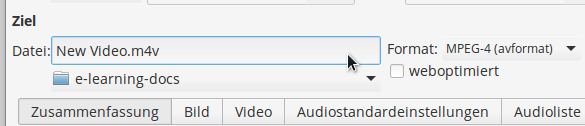
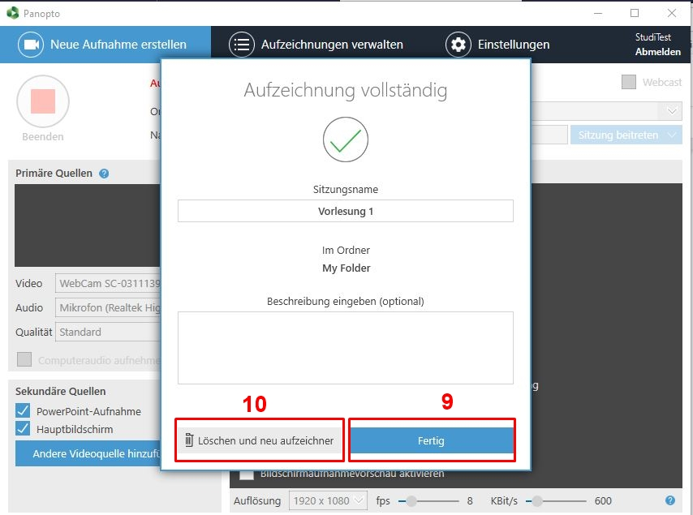
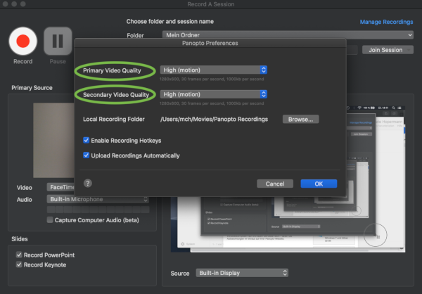
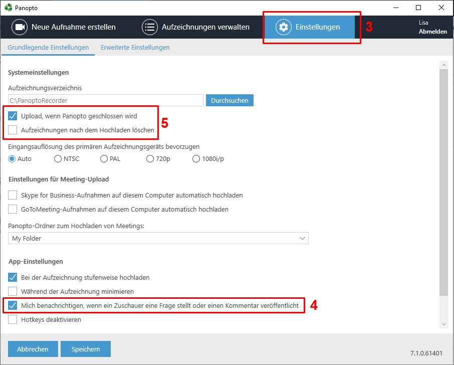

# Videos

## Bildschirmaufzeichnung mit Camtasia

Vom Rechenzentrum gibt es ein umfassendes Video zur Erstellung von Vorlesungen und Videoinhalten mit Camtasia.

Ab 20:50 gibt es Empfehlungen zu Umfang und der Vorbereitung von Onlinevorlesungen.

Ab 31:30 geht es konkret um die Programmoberfläche anhand einer Beispielvorlesung.

<iframe
  width="640"
  height="360"
  src="https://videoportal.vm.uni-freiburg.de/media/embed?key=503cf8f2f5e0fbe99c5a85939f808ba9&width=640&height=360&autoplay=false&autolightsoff=false&loop=false&chapters=false&related=false&responsive=false&t=1250
"
  allowfullscreen
></iframe>

### Praktische Tastenkombinationen

Unter Windows starten Sie die Aufzeichnung mit der Taste **F9** und stoppen Sie mit **F10**. Pausieren und Fortfahren geschieht ebenfalls durch **F9**.

Unter MacOS starten Sie die Aufzeichnung mit **Command+Shift+2** und stoppen mit **Command+Option+2**. Pausieren und Fortfahren geschieht ebenfalls mit **Command+Shift+2**.

### Exportieren für Ilias
Klicken Sie im grünen Menü "Weitergeben" auf "Lokale Datei" und wählen Sie "Nur MP4 (720p)". Diese Einstellung ist für die meisten Anwendungen ausreichend und sorgt dafür, dass die Dateigröße "im Rahmen bleibt".

 

## Videos auf ILIAS hochladen

Um Videos so auf ILIAS einzubinden, dass sie direkt abspielbar sind, haben Sie folgende Möglichkeiten:

1. [Direkter Upload in Ilias](#direkter-upload-in-ilias)

2. [Einbetten über "Mediacast"](#einbetten-%C3%BCber-das-objekt-mediacast)

3. [Einbinden über "ViMP"](#einbinden-%C3%BCber-vimp)

4. [Als Interaktives Video einfügen](#interaktives-video)

5. [Zu große Videos konvertieren](#zu-gro%C3%9Fe-videos-konvertieren)

### Direkter Upload in Ilias
Auf Kurs- und Ordner-Ebene gibt es oben auf der Seite einen Link "Seite gestalten". Klickt man auf
diesen Link, kann man anschließend über das [+]-Zeichen "Bild/Audio/Video einfügen" auswählen.
Über [Datei wählen] lässt sich im nächsten Schritt z.B. eine MP4-Videodatei auswählen.

 

Das Einbinden auf diesem Weg funktioniert auch in anderen ILIAS-Objekten (z.B. in Wikis, Lernmodulen
usw.). 

Die Uploadgrenze liegt bei 500 MB pro Video.

### Einbetten über das Objekt "Mediacast"
Das Objekt Mediacast findet man unter [Neues Objekt hinzufügen]. Der Mediacast eignet sich gut für
eine Video-Reihe, also – ähnlich, wie bei einem Podcast – für ein Video-Repositorium, das regelmäßig
um neue Videos ergänzt wird. Anders als bei der ersten Möglichkeit werden die Videos nicht in die
Kursseite eingebunden, sondern erscheinen in einem eigenen Objekt. Es lassen sich unterschiedliche
Darstellungsformen auswählen, optional kann auch ein Download ermöglicht werden. 

Die Uploadgrenze liegt auch hier bei 500 MB pro Video.

Hier finden Sie genaue Infos zum Videoupload mit Mediacast: https://ilias.uni-freiburg.de/goto.php?target=pg_57504_221303&client_id=unifreiburg

### Einbinden über "ViMP"
Bei ViMP handelt es sich um den Videoserver der Universität Freiburg 
(https://videoportal.uni-freiburg.de). 

Über [Neues Objekt hinzufügen] lassen sich Videos in Form eines eigenen Objekts
einbinden. Sobald man eine Videodatei hochgeladen hat, wird diese automatisch und im Hintergrund ins korrekte Format
konvertiert. Die Uploadgrenze liegt bei 10 GB, d.h., diese Methode eignet sich gut für
größere Videodateien. Die Videos lassen sich über das Plugin verwalten und können z.B. auch in
unterschiedliche Kurse eingebunden werden, ohne dass man sie mehrfach hochladen muss. Es
besteht außerdem ein erweiterter Content-Schutz und die Möglichkeit, ein ViMP-Video über "Seite
gestalten" einzubinden.

Hier finden Sie eine bebilderte Anleitung zum Einbinden über ViMP: [https://ilias.uni-freiburg.de/goto.php?target=wiki_1229029_ViMP-Objekt](https://ilias.uni-freiburg.de/ilias.php?ref_id=1229029&page=ViMP-Objekt&wpg_id=18079&cmd=downloadFile&cmdClass=ilwikipagegui&cmdNode=189:sm:18c&baseClass=ilwikihandlergui&file_id=il__file_1870362)

### Interaktives Video
Mit Hilfe dieses Werkzeuges können Sie im Video an beliebigen Stellen Fragen platzieren, die beim
Abspielen des Videos angezeigt werden, während das Video pausiert. Zudem können die Lernenden
und die Lehrenden einzelne Zeitpunkte oder ganz Passagen im Video annotieren bzw. kommentieren
und, falls gewünscht, die Kommentare der anderen Lernenden sehen. Alles, was dazu benötigt wird,
ist eine Video- oder Audio-Datei, die einfach auf ILIAS hochgeladen werden muss und von den
gängigen Browsern wiedergegeben werden kann (z.B. MP4/h.264). 

Über [Neues Objekt hinzufügen] können Sie das Objekt "Interaktives Video" erzeugen. Die Uploadgrenze liegt bei 500 MB. Sie können
aber auch Videos von youtube oder vimeo einbinden oder eine direkte URL zu einer Mediendatei im
Web angeben.

Hier finden Sie weitere Infos zu Interaktiven Videos:
https://ilias.uni-freiburg.de/goto.php?target=pg_37783_221303&client_id=unifreiburg

### Zu große Videos konvertieren
Sollte Ihr Video größer als das Uploadlimit sein, können Sie es mit einem Videokonverter in ein kompaktes Format umwandeln. Eine gute kostenfreie Software ist [Handbrake](https://handbrake.fr/).

**Kurzanleitung Handbrake**

Wählen Sie **Quelle** in der Werkzeugleiste oder ziehen Sie das Video per Drag & Drop in das Fenster.

**Videoeinstellungen wählen**

Geben Sie im Reiter **Bild** für Speichergeometrie (Auflösung) 1280x720 ein. 
Im Reiter **Video** stellen Sie die Bildrate auf "Wie Quelle" und geben eine **Bitrate** ein.
Für Bildschirmaufzeichnungen sind Werte von 1000 bis 2000 ausreichend, für bewegte Videos sind 5000 empfehlenswert.

**Den Ausgabeordner wählen**

Geben Sie einen Ausgabeordner und Dateinamen an. Dort wird das fertige Video gespeichert. Die Dateiendung sollte auf .mp4 oder .m4v gestellt sein.

Wählen Sie den Start-Knopf in der Werkzeugleiste, um den Kodiervorgang zu starten.

## Panopto

Panopto können Sie für Live-Webcasts und Webinare nutzen, zur Bildschirm- und Powerpointaufzeichnung verwenden
sowie Videobearbeitung mit vielfältige Anmerkungen und Quizzes durchführen.
Jedoch ist die Veröffentlichung auf Ilias derzeit noch nicht zuverlässig möglich. (Stand 8.5.2020)

Hier ein umfassendes Webinar zu Panopto und Illias.

<iframe src="https://www.videoportal.uni-freiburg.de/media/embed?key=8211679d99e8ebfdac9496c3c1969369&width=720&height=405&autoplay=false&autolightsoff=false&loop=false&chapters=false&related=false&responsive=false&t=0" data-src="" class="iframeLoaded" width="720" height="405" frameborder="0" allowfullscreen="allowfullscreen" allowtransparency="true" scrolling="no"></iframe>

### Panopto-Objekt erstellen

Wählen Sie in Ihrem Kurs "Neues Objekt"-> "Panopto".

**Geben Sie als Titel den exakten Namen Ihres Ilias-Kurses an, damit die Kursteilnehmer das Video/ den Webcast später sehen können.**

Klicken Sie dann auf "Erstellen". Vergessen Sie nicht, im Reiter "Einstellungen" das Panopto-Objekt online zu stellen.

### Videos hochladen

Nun können Sie im Reiter "Videos" über die Schaltfläche "Erstellen" -> "Medien hochladen".

Um das Video nun Ihren Kursmitgliedern in ILIAS zur Verfügung zu stellen, kopieren Sie die im Menü "Freigeben" angezeigte URL.
Die Einstellung "Bestimmte Personen" darf aus Datenschutzrechtlichen Gründen nicht verändert werden!

### Aufzeichnung erstellen mit Panopto (Windows)
Um eine Aufzeichnung zu starten, klicken Sie auf „Erstellen” 
und wählen Sie anschließend „Neue Sitzung aufzeichnen” aus. 

Dann öffnet sich der Panopto-Recorder, sofern Sie diesen bereits heruntergeladen haben.
Nun kann im oberen Feld der Zielordner und der Name der Aufzeichnung eingegeben werden.

Unter „Primäre Quellen” (1) kann auf der linken Hälfte die Video- und Audioquelle sowie die
Qualität eingestellt werden (1.1), bei Bedarf kann auch die Computeraudio aufgenommen
werden. Das linke, kleinere Aufnahmefenster ist für die Aufzeichnung des Dozierenden mit
der integrierten Kamera gedacht. Ist keine Aufnahme des Dozierenden gewünscht, einfach
bei „Video” als Quelle „Keine” auswählen, sodass das Kamerabild verschwindet. Bitte
kontrollieren Sie vor einer Aufzeichnung auch das Mikrofon, indem Sie unter „Audio” die
geeignete Quelle auswählen. Die Lautstärke können sie am blauen Balken neben der
Webcam regeln, sodass sich der Ton im grünen Bereich bewegt. Dazu müssen Sie
gegebenenfalls in den Soundeinstellungen ihres Laptops/Computers die Intensität anpassen.

Als „Sekundäre Quellen“ (2) können unten „PowerPoint-Aufnahme” und „Hauptbildschirm”
ausgewählt werden. Ist beides ausgewählt, teilt sich der rechte, größere Bildschirm in
„PowerPoint” und „Hauptbildschirm aufnehmen” (3) auf.
Unter „Hauptbildschirm aufnehmen” wird während der gesamten Aufzeichnung das Display aufgenommen, sodass
auch die Maus-Bewegungen verfolgt und Aktionen auf dem Bildschirm bei Bedarf erklärt
werden können. Eine Vorschau davon kann unten aktiviert werden, wenn das Häkchen bei
„Bildschirmaufnahmevorschau aktivieren” (3.1) gesetzt ist.

Im Feld „PowerPoint” (4) kann eine Präsentation geöffnet werden (4.1), entweder vor oder
nach Beginn der Aufzeichnung.

Wenn Sie die PowerPoint-Präsentation bereits vor der Aufzeichnung öffnen möchten, wird
folgendes Fenster aufgerufen. Hier können Sie entscheiden, ob beim Öffnen direkt die
Aufzeichnung gestartet werden soll oder erst später.

Wenn Sie auf „Nein” klicken, können Sie trotzdem direkt beim Start der Aufzeichnung die
PowerPoint öffnen lassen, sofern das Häkchen im nachfolgenden Fenster (5) aktiviert ist.
Wenn Sie nicht mit der PowerPoint starten möchten, deaktivieren Sie das Häkchen. Dann
können Sie die Aufzeichnung mit Klicken auf den roten Button (6) starten.

Nach dem Beenden öffnet sich ein Fenster, in dem Sie die Aufzeichnung umbenennen, den
Zielordner überprüfen und – wenn gewünscht – eine Beschreibung hinzufügen können.
Anschließend können Sie die Aufzeichnung fertigstellen (9), sodass diese in Ihren Ordner
hochgeladen wird, oder direkt löschen und bei Bedarf neu aufnehmen (10).

### Aufzeichnung erstellen mit Panopto (macOS)
Um eine Aufzeichnung zu starten, klicken Sie auf „Erstellen” 
und wählen Sie anschließend „Neue Sitzung aufzeichnen” aus. 

Dann öffnet sich der Panopto-Recorder, sofern Sie diesen bereits heruntergeladen haben.

Im Panopto-Recorder kann unter „Folder“ (1) ausgewählt werden, wo das Video später gespeichert werden soll, 
und unter „Session“ (2) können Sie die Aufzeichnung benennen.

Der Panopto-Recorder ist in „Primary Source” (3) und „Secondary Sources” (4) aufgeteilt.
Hier können jeweils verschiedene Quellen eingestellt werden, die später als Splitscreen
sichtbar sind (z.B. Integrierte Kamera und Display). Für eine Aufnahme mit dem Dozierenden
im linken kleinen Bild und einer Präsentation im größeren rechten Bild, wählen Sie unter
„Video“ (3.1.) die „Integrierte Kamera” aus und unter „Source“ (4.1.) den „Built-in Display”.
Es können hier auch andere Quellen angeschlossen werden, die dann unter 4.1. ausgewählt
werden. „Secondary 2“ auf der rechten Seite ist für eine weitere externe Quelle gedacht,
wenn diese benötigt wird.
Wollen Sie eine Präsentation zur Aufzeichnung miteinbinden, dann bitte links unten unter
„Slides“ (5) das für Ihre Präsentationssoftware passende Häkchen setzen („Record
PowerPoint” oder „Record Keynote”). Ihre Präsentation können Sie vor der Aufnahme schon
einmal öffnen, um Sie dann nach Betätigen des roten „Record“-Buttons oben links zu
starten.

Bitte kontrollieren Sie vor der Aufzeichnung auch das Mikrofon (6). Hier können Sie ebenfalls
verschiedene Quellen auswählen, sofern diese angeschlossen/installiert sind. Für das oben
beschriebene Szenario hier bitte „Built-in Microphone” auswählen. Der Balken darunter
sollte sich im grünen Bereich bewegen, um eine gute Tonqualität zu erreichen. Dazu müssen
Sie gegebenenfalls in den Soundeinstellungen ihres Laptops/Computers die Intensität
anpassen.

Die Qualität der Kamera können sie oben links unter „Panopto” und dann „Preferences”
bearbeiten. Für Präsentationen empfiehlt es sich, die Auswahl „High (motion)” zu wählen.

Nachdem alle Quellen ausgesucht sind, starten Sie die Aufnahme, rufen Ihre Präsentation
auf und starten auch diese. Nun können Sie wie gewohnt ihren Vortrag halten. Natürlich
können Sie während ihrer Aufzeichnung auch jederzeit auf „Pause“ drücken. Zum Beenden
der Aufzeichnung drücken Sie auf „Stop”.

Nun können Sie die Aufzeichnung benennen, eine Beschreibung eingeben und mit „Upload“ hochladen. 
Sie können die Aufnahme auch erneut starten, sodass die aufgenommene Datei automatisch gelöscht wird. 
Dazu einfach auf „Delete and record again” klicken.

### Livestream/Webcast erstellen (Windows)

Zum Starten eines Livestreams wählen Sie das Fenster „Erstellen” an und klicken
anschließend auf die Funktion „Neue Sitzung aufzeichnen”, wie zur Erstellung einer
normalen Sitzungsaufzeichnung. Anschließend öffnet sich der Panopto-Recorder.

Die Benennung der Aufzeichnung und die Einstellung von Kamera und Mikrofon im Panopto-
Recorder verlaufen gleich, wie zur Erstellung einer normalen Sitzungs-Aufzeichnung.

Um daraus einen Livestream zu machen, klicken Sie auf das Feld „Webcast” (1) rechts oben. Ist das Feld mit
einem Häkchen aktiviert, kann der Livestream gestartet werden.
Im Bereich unten rechts wird nun die Diskussions-Leiste (2) eingeblendet, hier werden
Diskussionsbeiträge von ZuschauerInnen angezeigt. Um diese und weitere Funktionen zu
ändern, klicken Sie rechts oben im Menü des Panopto-Recorders auf „Einstellungen” (3).

Unter „Einstellungen” (3) können Sie Diskussionsbeiträge aktivieren (4).
Allerdings sehen Sie die Kommentare nur, wenn Sie gerade keine PowerPoint-
Präsentation geöffnet haben. 
Falls Sie das Video nach der Aufzeichnung automatisch in Ihren Ordner hochladen, 
sodass es auch nach dem Livestream zur Verfügung steht (Feld unter 5 ankreuzen: „Upload, wenn Panopto geschlossen wird”),
können die Beiträge im Diskussionsfeld auch im Nachhinein angesehen werden. Wenn Sie während des
Livestreams gar keine Kommentare zulassen wollen, deaktivieren Sie diese Funktion (4).

Um den Livestream zu starten, klicken Sie wie zur normalen Sitzungs-Aufnahme auf
„Aufzeichnen”. Sobald der Stream beginnt, wird rechts unten der Webcast-Link
angezeigt, den Sie nun für ZuschauerInnen kopieren oder freigeben können.

Die Studierenden, die sich in Ihrem Ilias-Kurs eingeloggt haben, finden
den Livestream aber auch auf normalem Weg über den Panopto-Ordner auf Ilias.

### Livestream/Webcast erstellen (macOS)

Wenn sich der Panopto-Recorder geöffnet hat, haben Sie dort die Möglichkeit, den Ordner
auszuwählen, in dem der beendete Stream gespeichert werden soll (1) sowie die Datei zu
benennen (2). Die Aufteilung der Quellen in „Primary Source“ (3/3.1.) und „Secondary
Sources“ (4/4.1/5) ist dieselbe wie zur Aufnahme einer ‚normalen‘ Aufzeichnung (siehe: 2.
Aufzeichnung erstellen mit dem Panopto-Recorder – 2.2 Mit macOS). Um nun einen
Livestream zu erstellen, setzen Sie das Häkchen bei „Webcast“ (unter der Ordnerauswahl (1)
und der Benennung der Session (2)).

Sobald Sie auf „Record“ klicken und damit den Livestream starten, wird ein Link generiert
(1), den Sie über „Share“ (2) mit Studierenden oder anderen ZuschauerInnen teilen können.
Die Studierenden, die sich in Ihrem Ilias-Kurs eingeloggt haben, finden den Livestream aber
auch auf normalem Weg über den Panopto-Ordner auf Ilias. Dann können Sie wie gewohnt
die Präsentation starten (falls benötigt) und Ihren Vortrag beginnen.

