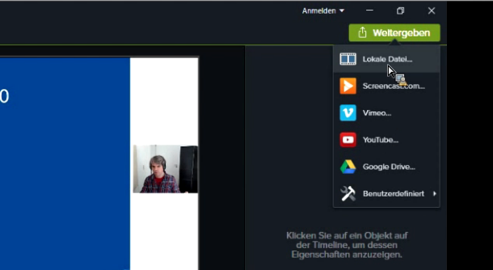
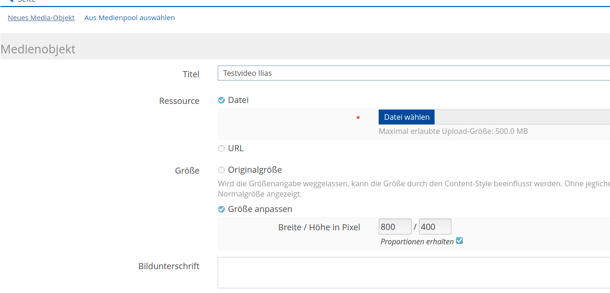

# Video-Tools

## Online-Vorlesungen erstellen

Mit [Camtasia](https://www.techsmith.com/download/camtasia/) kann der Bildschirm inklusive Sprache aufgezeichnet werden und die entstandene Aufzeichnung geschnitten, bearbeitet und erweitert werden. Das Institut besitzt Lizenzen für Camtasia.

Vom Rechenzentrum gibt es ein umfassendes Video zur Erstellung von Vorlesungen und Videoinhalten mit Camtasia.

Ab 20:50 gibt es allgemeine Empfehlungen zu Umfang und der Vorbereitung von Onlinevorlesungen.

Ab 31:30 geht es konkret um die Programmoberfläche von Camtasia anhand einer Beispielvorlesung.

<iframe
  width="640"
  height="360"
  src="https://videoportal.vm.uni-freiburg.de/media/embed?key=503cf8f2f5e0fbe99c5a85939f808ba9&width=640&height=360&autoplay=false&autolightsoff=false&loop=false&chapters=false&related=false&responsive=false&t=1250
"
  allowfullscreen
></iframe>

### Praktische Tastenkombinationen zu Camtasia

Unter Windows starten Sie die Aufzeichnung mit der Taste **F9** und stoppen Sie mit **F10**. Pausieren und Fortfahren geschieht ebenfalls durch **F9**.

Unter MacOS starten Sie die Aufzeichnung mit **Command+Shift+2** und stoppen mit **Command+Option+2**. Pausieren und Fortfahren geschieht ebenfalls mit **Command+Shift+2**.

### Videos aus Camtasia exportieren
Klicken Sie im grünen Menü "Weitergeben" auf "Lokale Datei" und wählen Sie "Nur MP4 (720p)". Diese Einstellung ist für die meisten Anwendungen ausreichend und sorgt dafür, dass die Dateigröße "im Rahmen bleibt".

 

## Videos auf Ilias hochladen

Um Videos so auf Ilias einzubinden, dass sie direkt abspielbar sind, haben Sie folgende Möglichkeiten:

1. [Direkter Upload in Ilias](#direkter-upload-in-ilias)

2. [Einbetten von YouTube](#einbetten-von-youtube)

3. [Einbetten über "Mediacast"](#einbetten-%C3%BCber-das-objekt-mediacast)

4. [Einbinden über "ViMP"](#einbinden-%C3%BCber-vimp)

5. [Als Interaktives Video einfügen](#interaktives-video)

### Direkter Upload in Ilias
Auf Kurs- und Ordner-Ebene gibt es oben auf der Seite einen Link "Seite gestalten". Klickt man auf
diesen Link, kann man anschließend über das [+]-Zeichen "Bild/Audio/Video einfügen" auswählen.
Über [Datei wählen] lässt sich im nächsten Schritt z.B. eine MP4-Videodatei auswählen.

 

Das Einbinden auf diesem Weg funktioniert auch in anderen ILIAS-Objekten (z.B. in Wikis, Lernmodulen
usw.). 

Die Uploadgrenze liegt bei 500 MB pro Video. Ggf. können Sie [zu große Videos konvertieren](#zu-gro%C3%9Fe-videos-konvertieren).

### Einbetten von Youtube
Falls Sie einen Youtube-Account besitzen, können Sie ihre Videos unsichtbar als "nicht gelistet" hochladen und in Ilias einbetten.

Um Videos mit einer Länge von über 15 Minuten hochzuladen, müssen Sie einen sog. bestätigten Account haben. Dafür erhalten Sie per SMS einen Bestätigungscode ([youtube.com/verify](https://www.youtube.com/verify)).

Zum Hochladen wählen Sie das Erstellen-Icon und "Videos hochladen".
Achten Sie beim Upload darauf, "nicht gelistet" auszuwählen, um das Video nicht auf Ihrem Youtube-Kanal zu veröffentlichen.

 

Warten Sie, bis das Video hochgeladen und verarbeitet wurde. Klicken Sie nun in der Videoübersicht auf das Youtube-Icon, um es anzusehen.

Wählen Sie nun "Teilen" -> "Einbetten" und aktivieren Sie den "Erweiterten Datenschutzmodus".
  

Hier können Sie den Embedd-Code des Videos kopieren und in Ihre Ilias-Seite über "Seite gestalten" -> "Text einfügen" einbetten.
Das Video sollte nun für alle Kursteilnehmer sichtbar sein, jedoch nicht für Besucher Ihres Youtube-Kanals.

### Einbetten über das Objekt "Mediacast"
Das Objekt Mediacast findet man unter [Neues Objekt hinzufügen]. Der Mediacast eignet sich gut für
eine Video-Reihe, also – ähnlich, wie bei einem Podcast – für ein Video-Repositorium, das regelmäßig
um neue Videos ergänzt wird. Anders als bei der ersten Möglichkeit werden die Videos nicht in die
Kursseite eingebunden, sondern erscheinen in einem eigenen Objekt. Es lassen sich unterschiedliche
Darstellungsformen auswählen, optional kann auch ein Download ermöglicht werden. 

Die Uploadgrenze liegt auch hier bei 500 MB pro Video. Ggf. können Sie [zu große Videos konvertieren](#zu-gro%C3%9Fe-videos-konvertieren).

Hier finden Sie genaue Infos zum Videoupload mit Mediacast: https://ilias.uni-freiburg.de/goto.php?target=pg_57504_221303&client_id=unifreiburg

### Einbinden über "ViMP"
Bei ViMP handelt es sich um den Videoserver der Universität Freiburg 
(https://videoportal.uni-freiburg.de). 

Über [Neues Objekt hinzufügen] lassen sich Videos in Form eines eigenen Objekts
einbinden. Sobald man eine Videodatei hochgeladen hat, wird diese automatisch und im Hintergrund ins korrekte Format
konvertiert. Die Uploadgrenze liegt bei 10 GB, d.h., diese Methode eignet sich gut für
größere Videodateien. Die Videos lassen sich über das Plugin verwalten und können z.B. auch in
unterschiedliche Kurse eingebunden werden, ohne dass man sie mehrfach hochladen muss. Es
besteht außerdem ein erweiterter Content-Schutz und die Möglichkeit, ein ViMP-Video über "Seite
gestalten" einzubinden.

Hier finden Sie eine bebilderte Anleitung zum Einbinden über ViMP: [https://ilias.uni-freiburg.de/goto.php?target=wiki_1229029_ViMP-Objekt](https://ilias.uni-freiburg.de/ilias.php?ref_id=1229029&page=ViMP-Objekt&wpg_id=18079&cmd=downloadFile&cmdClass=ilwikipagegui&cmdNode=189:sm:18c&baseClass=ilwikihandlergui&file_id=il__file_1870362)

### Interaktives Video
Mit Hilfe dieses Werkzeuges können Sie im Video an beliebigen Stellen Fragen platzieren, die beim
Abspielen des Videos angezeigt werden, während das Video pausiert. Zudem können die Lernenden
und die Lehrenden einzelne Zeitpunkte oder ganz Passagen im Video annotieren bzw. kommentieren
und, falls gewünscht, die Kommentare der anderen Lernenden sehen. Alles, was dazu benötigt wird,
ist eine Video- oder Audio-Datei, die einfach auf ILIAS hochgeladen werden muss und von den
gängigen Browsern wiedergegeben werden kann (z.B. MP4/h.264). 

Über [Neues Objekt hinzufügen] können Sie das Objekt "Interaktives Video" erzeugen. Die Uploadgrenze liegt bei 500 MB. Sie können
aber auch Videos von youtube oder vimeo einbinden oder eine direkte URL zu einer Mediendatei im
Web angeben.

Hier finden Sie weitere Infos zu Interaktiven Videos:
https://ilias.uni-freiburg.de/goto.php?target=pg_37783_221303&client_id=unifreiburg

## Zu große Videos konvertieren
Sollte Ihr Video größer als das Uploadlimit sein, können Sie es mit einem Videokonverter in ein kompaktes Format umwandeln. Eine gute kostenfreie Software ist [Handbrake](https://handbrake.fr/).

**Kurzanleitung Handbrake**

Wählen Sie **Quelle** in der Werkzeugleiste oder ziehen Sie das Video per Drag & Drop in das Fenster.

**Bild- und Videoeinstellungen wählen**

Geben Sie im Reiter **Bild** für Speichergeometrie (Auflösung) 1280x720 ein. 
Im Reiter **Video** stellen Sie die Bildrate auf "Wie Quelle" und geben eine **Bitrate** ein.
Für Bildschirmaufzeichnungen sind Werte von 500 bis 1500 ausreichend, für bewegte Videos sind 5000 empfehlenswert.

**Den Ausgabeordner wählen**

Geben Sie einen Ausgabeordner und Dateinamen an. Dort wird das fertige Video gespeichert. Die Dateiendung sollte auf .mp4 oder .m4v gestellt sein.

Wählen Sie den Start-Knopf in der Werkzeugleiste, um den Kodiervorgang zu starten.

Die kovertierten Videos sollten nun kleiner als 500 MB sein und auf Ilias hochgeladen werden können.