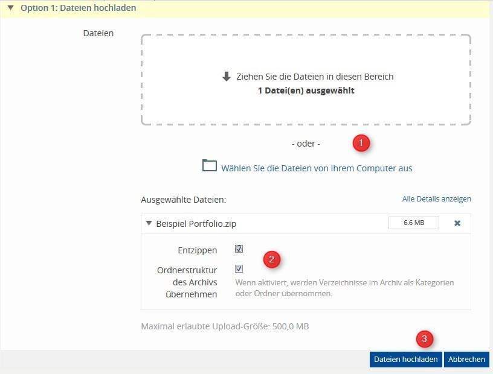

# Ilias

## Neue Lehrveranstaltungen anlegen
Das Anlegen von Kursräumen geschieht immer über das Magazin. Gehen Sie wie folgt vor:
 
### Fachbereich finden
Klicken Sie auf „Magazin“; es öffnet sich ein drop-down Menü. Wählen Sie hier den Menüpunkt „Magazin- Einstiegsseite“.
Es öffnet sich nun der Veranstaltungskatalog. Wählen Sie das gewünschte Semester aus (1). Der nun erscheinende Katalog ist nach Fakultäten sortiert. Wählen Sie die gewünschte Fakultät und klicken Sie sich zum gewünschten Institut/Fachbereich durch, in dem Sie die Lehrveranstaltung anlegen möchten. Die Navigation zu dem entsprechenden Institut/Fachbereich ist auch über das „Übersicht“-Menü (2) möglich.

### Kurs anlegen
Wenn Sie sich in dem Ordner von Ihrem Fachbereich/Institut befinden (1), sehen Sie links oben den Button „Neues Objekt hinzufügen“ (2). Klicken Sie auf den Schriftzug und wählen Sie im erscheinenden Menü die Option „Kurs“ aus. Es öffnet sich nun die Maske zur Erstellung eines neuen Kurses.

**Option 1: Neuen Kurs anlegen**
Mit dieser Option wird ein komplett neuer Kurs angelegt. Geben Sie hier den Titel Ihrer Veranstaltung, wie er auch im Vorlesungsverzeichnis erscheint, ein (1) und ggfs. eine Beschreibung. Bestätigen Sie mit "Kurs anlegen" (2) Sobald der Kurs angelegt wurde, können weitere Einstellungen (siehe nächste Seite) vorgenommen werden.

**Option 2: Kurs kopieren**
Mit dieser Option können Sie Kurse kopieren, die Sie bereits auf ILIAS angelegt haben (z.B. Veranstaltungen aus dem vergangenen Semester). Es werden alle Einstellungen und Dokumente übernommen, jedoch keine Teilnehmerdaten. Geben Sie hierzu den Titel des Kurses ein (1), den Sie gerne kopieren möchten und bestätigen Sie mit "Weiter" (2). Im nächsten Fenster wird Ihnen eine Auswahl an Kursen angezeigt, die den von Ihnen angegebene Titel enthalten. Wählen Sie den gewünschten Kurs aus und bestätigen Sie mit dem Button „Kurs kopieren“.

### Kurseinstellungen bearbeiten
Nachem Sie Ihren Kurs angelegt oder kopiert haben, können Sie verschiedene Einstellungen vornehmen, indem Sie auf den gleichnamigen Reiter klicken. Hier können Sie sich z. B. den Titel Ihres Kurses ändern, ihn online schalten, die Zugriffsdauer und das Anmeldeverfahren wählen.

Ergänzen Sie hier, sofern noch nicht geschehen, den Titel der Veranstaltung, so wie im Vorlesungsverzeichnis verzeichnet, damit er für die Studierenden leicht auffindbar ist. Fügen Sie ggfs. eine Beschreibung des Kurses hinzu. Im Unterschied zum Typ "Standard" können in einem "Kollaborativen Kurs" die Kursteilnehmenden selbst Objekte wie Dateien, Ordner, Wikis, Foren, Abstimmungen etc. anlegen.

Sie stellen Ihren Kurs den Studierenden zur Verfügung, indem Sie das Häkchen in der Box nebem dem Schriftzug "Online" aktivieren. Der Kurs ist nun im Kurskatalog sichtbar.
**Solange kein Häkchen bei "online" gesetzt ist, ist der Kurs nur für Kursadministrator/innen und Tutor/innen sichtbar.**
 
Geben Sie unter "Zeitlich begrenzte Verfügbarkeit" die Zeitspanne Ihres Kurses ein.
Sofern Sie urheberrechtlich geschützte Materialien in Ihrem Kurs bereitstellen - z.B. gescannte Seiten aus einem Lehrbuchnach §52a UrhG - ist es rechtlich notwendig, dass Sie den Zugriff auf diese Materialien mit Anbschluss des Kurses beenden. Wir empfehlen daher immer, bei zeitlicher Verfügbarkeit immer die reale Kursdauer einzutragen.
 
Im Bereich "Selbstständiger Beitritt durch Benutzer" können Sie einstellen, wie sich die Studierenden selbst für den Kurs registrieren können.

**Ist die Anmeldung ausgeschaltet, "Kein selbstständiger Beitritt", können die nur von den Kursadministrator/innen dem Kurs hinzugefügt werden.**

Wenn Sie optional "Beitritt per Link" auswählen, so erhalten Sie zusätzlich einen Link zu Ihrer Veranstaltung, den Sie den Teilnehmer/innen z. B. per E-Mai zusenden können. Dies erleichtert das erste Auffinden des Kurses.
 
Unter "Zusätzliche Funktionen" können Sie u. a. entscheiden, ob die Mitglieder des Kurses angezeigt werden sollen oder nicht - wir empfehlen aus Datenschutzgründen dringend, die Mitgliederliste nicht anzeigen zu lassen.

**Bestätigen Sie abschließend die vorgenommenen Einstellungen mit dem "Speichern"-Button!**

Detaillierte Infos unter [https://ilias.uni-freiburg.de/goto.php?target=pg_144454_1499949](https://ilias.uni-freiburg.de/goto.php?target=pg_144454_1499949&client_id=unifreiburg)

## Kursadministratoren und Tutoren eintragen

Sie können Ihrem Kurs Administrator/innen und Tutor/innen hinzufügen, die mit Ihnen zusammen den Kurs verwalten. Wählen Sie im Kurs den Reiter "Mitglieder" (1) und dort den Menüpunkt "Teilnehmerverwaltung" (2).

Falls die Personen noch nicht zu dem Kurs hinzugefügt wurden, können Sie  in dem Textfeld "Benutzer" (3) Mitglieder durch das Eintragen ihres ILIAS-Kürzels hinzufügen (xy999) und dann die Rolle für die Person in dem Kurs bestimmen (4).

Wichtig: Geben Sie im Feld "Benutzer" die Uni-Account-Benutzerkennung des entsprechenden Teilnehmenden mit dem Zusatz "_uni-freiburg" ein (Bsp: xy999_uni-freiburg). Dann können Sie die gewünschte Rolle wählen, die die Person in Ihrem Kurs einnehmen soll (Kursadministrator, Kurstutor, Kursmitglied) und bestätigen Sie mit "Hinzufügen".

Hinweis zum Button "Benutzer suchen": aus Datenschutzgründen ist die Benutzersuche in ILIAS deaktiviert. Eingaben in der Suchmaske führen zu keinem Ergebnis. Bitte fügen Sie daher Kursmitglieder, Tutoren und Administratoren manuell über den oben beschriebenen Weg hinzu.

Möglichkeit 2 ist möglich, wenn die Personen, die sie zu Kursadministrator*innen oder Tutor*innen machen möchten, bereits Mitglied Ihres Kurses sind. Sie können die Kolleg*innen z. B. bitten, sich in Ihren Kurs einzubuchen.

Wenn Sie ein Häkchen vor den Namen setzen und auf "Barbeiten klicken", können Sie die mit Häkchen markierten Person "Bearbeiten", "Entfernen", eine "Mail verschicken" oder "Der Zwischenablage hinzufügen" (2).

Auch rechts neben dem Uni-Accountnamen und den zugewiesenen Rollen, ist ein "Bearbeiten"-Button. Auch auf diesem Weg können Sie  mit Klick auf "Bearbeiten" (1) rechts neben dem Namen den Personen eine neue Rolle (3) zuweisen. 

Klicken Sie dann auf "Speichern" (4)

Detaillierte Infos unter [https://ilias.uni-freiburg.de/goto.php?target=pg_144459_1499949](https://ilias.uni-freiburg.de/goto.php?target=pg_144459_1499949&client_id=unifreiburg)

## Ordner und Dokumente

Um in Ihren Kurs Materialien hochzuladen, wechseln Sie auf den Reiter
„Inhalte“ und klicken rechts auf „Neues Objekt hinzufügen“.

### Dateien
Wählen Sie „Datei“ aus. Sie können nun entscheiden, ob Sie eine oder mehrere Dateien per Drag&Drop
auf ILIAS ziehen oder diese von Ihrem Computer auswählen.
Sie können den Dateinamen nachträglich über „Aktionen“ -> „Inhalt bearbeiten“ ändern.

### Ordner
Wählen Sie „Ordner“ aus und geben Sie diesem einen Titel. Dieser ist
nun in Ihrem Kurs sichtbar und kann mit Dateien gefüllt werden. 
Beim Typ **„Standardordner“** dürfen nur die Kurs-Admins und Tutoren, beim Typ **„Uploadordner“** auch die Kursmitglieder Dateien
hochladen.

Über den Reiter „Verwalten“ können Sie bereits hochgeladene Dateien in den Ordner verschieben.

### Mehrere Ordner hochladen

Sie haben die Möglichkeit,
alle Ordner bereits auf Ihrem
Arbeitsrechner vorzubereiten,
mit Dateien zu füllen und als
Ganzes auf ILIAS hochzuladen.
Dies erspart eine Menge Arbeit.

Führen Sie zunächst auf Ihrem lokalen
Datenträger die gewünschten
Ordner und Dateien **in einer zip-Datei** zusammen. Anschließend
ziehen Sie die zip-Datei per
Drag&Drop oder über „Wählen
Sie die Dateien von Ihrem
Computer aus“ auf ILIAS (1).
ILIAS erkennt automatisch, dass
es sich um eine zip handelt.

Haken Sie „Entzippen“ an (2),
lassen Sie „Ordnerstruktur des
Archivs übernehmen“ aktiviert und bestätigen Sie mit „Dateien hochladen“ (3).

## Tests
Das ILIAS-Objekt "Test", kann in einem Kursraum über die Schaltfläche "Neues Objekt hinzufügen" angelegt werden.
Es steht eine große Menge an unterschiedlichen Fragetypen zur Verfügung. Sie können zudem Rückmeldung zu einzelnen Fragen bzw. Antworten hinterlegen und Musterlösungen einstellen.

### Fragenpools
Fragen kann man entweder direkt im Test oder über einen Fragenpool anlegen. Ein Fragenpool kann für mehrere verschiedene Tests wiederverwendet werden.
Fragenpools sind eigenständige Elemente und können daher an einem anderen Ort im Magazin angelegt werden. Wenn Sie Fragen aus einem Fragenpool beispielsweise in mehreren Veranstaltungen verwenden wollen, können Sie diese in einem Fragenpool in dem Bereich "Semesterübergreifende Inhalte" sammeln.

Um einen Fragenpool anzulegen, wählen Sie in der rechten oberen Ecke unter "Objekt hinzufügen" "Fragenpool für Test" bzw. "Fragenpool für Umfrage" aus.
Im Fragepool können Sie nun neue Fragen anlegen.

### Test erstellen
Wählen Sie in einem Kursraum die Schaltfläche "Neues Objekt hinzufügen" -> "Test".
Wählen Sie einen Titel und klicken Sie auf "Test anlegen".

Es gibt verschiedene Testmodi:

**Test mit fest definierter Fragenauswahl:**
In diesem Modus kann eine feste Auswahl von Fragen definiert werden, welche für alle Teilnehmer gilt. Abhängig von der weiteren Konfiguration des Tests haben die Teilnehmer einen oder mehrere Versuche für den Test.

**Test mit zufälliger Fragenauswahl:**
In diesem Modus werden ein oder mehrere Fragenpool(s) ausgewählt, aus welchem für jeden Teilnehmer eine eigene zufällige Fragenauswahl verwendet wird. Abhängig von der weiteren Konfiguration des Tests haben die Teilnehmer einen oder mehrere Versuche für den Test.

**Fortlaufender Test über Fragenpool:**
In diesem Modus wird genau ein Fragenpool ausgewählt. Die Testdurchführung erfolgt in einem niemals endenden Durchlauf, in welchem die Fragenauswahl für jeden Teilnehmer individuell und zur Laufzeit erfolgt.

Über den Reiter "Fragen" können Sie dem Test nun Fragen hinzufügen. Dabei können Sie entweder Fragen direkt im Fragepool erstellen oder Fragen aus einem Pool hinzufügen, den Sie zuvor angelegt haben. Sie können auch Fragen aus einem anderen Test hinzufügen, den Sie bereits erstellt haben.

Hier gibt es weitere Infos zu den 19 verschieden Fragetypen: [https://ilias.uni-freiburg.de/goto.php?target=pg_145532_1499965](https://ilias.uni-freiburg.de/goto.php?target=pg_145532_1499965&client_id=unifreiburg)

### Rückmeldung geben
Auf ILIAS haben Sie zwei verschiedene Möglichkeiten, den Studierenden Feedback zu den bearbeiteten Tests zu geben. Zum einen können Sie fragenspezifischen (Text-)Feedback geben oder aber eine Musterlösung in Form eines Lernmoduls, einer Datei etc. zur Verfügung stellen.
Rückmeldung zu einer bestimmten Frage geben Sie direkt beim Erstellen einer Frage ein. Hierfür wechseln Sie beim Bearbeiten einer Frage auf den Reiter "Rückmeldung".
Sie können nun die richtige Lösung eingeben, die immer angezeigt wird (sofern dies bei den Testeinstellungen entsprechend aktiviert wurde). Alternativ können Sie eine Rückmeldung eingeben, die nur angezeigt wird, wenn mindestens eine Antwort nicht richtig ist. Es besteht zusätzlich die Möglichkeit für jede Antwortalternative eine spezifische Rückmeldung einzugeben.

Damit die Studierenden die Rückmeldung auch sehen können, ist es wichtig, die entsprechende Option auch in den Testeinstellungen zu aktivieren.
Um die antwortspezifischen Rückmeldung zu aktivieren, wählen Sie im Test den Reiter "Einstellungen" und dort die Unterkategorie "Auswertung".

### Lösungshinweise geben
Klicken Sie bei der jeweiligen Frage auf "Lösungshinweise hinzufügen".
Sie können einstellen, ob es durch das Einsehen des Lösungshinweises für die Teilnehmenden einen Punktabzug geben soll.
Die Lösungshinweise sind für die Studierenden nur sichtbar, wenn Sie dies in den Testeinstellungen entsprechend aktivieren (Häckchen bei "Rückmeldungen, siehe oben").

### Musterlösung bereitstellen
Sie können unter "Einstellungen" der Übung eine Musterlösung hinterlegen.
Dazu müssen Sie unter "Musterlösung" ein Häkchen setzen, eine Datei auswählen, die die Musterlösung beinhaltet, sowie Verfügbarkeit und Benachrichtung einstellen.

### Bewertung
Wählen Sie im jeweiligen Test den Reiter "Einstellungen" und dort die Unterkategorie "Auswertung", um verschiedene Bewertungseinstellungen zu treffen.

### Zertifikate
Sie können es den Studierenden ermöglichen, sich nach der Bearbeitung eines Test ein Zertifikat ausstellen zu lassen.
Die geschieht in den Testeinstellungen in der Unterkategorie "Zertifikat".

**Vollständige Infos zu Tests finden Sie auf Ilias:** https://ilias.uni-freiburg.de/ilias.php?ref_id=1499965&cmd=layout&cmdClass=illmpresentationgui&cmdNode=h9&baseClass=ilLMPresentationGUI