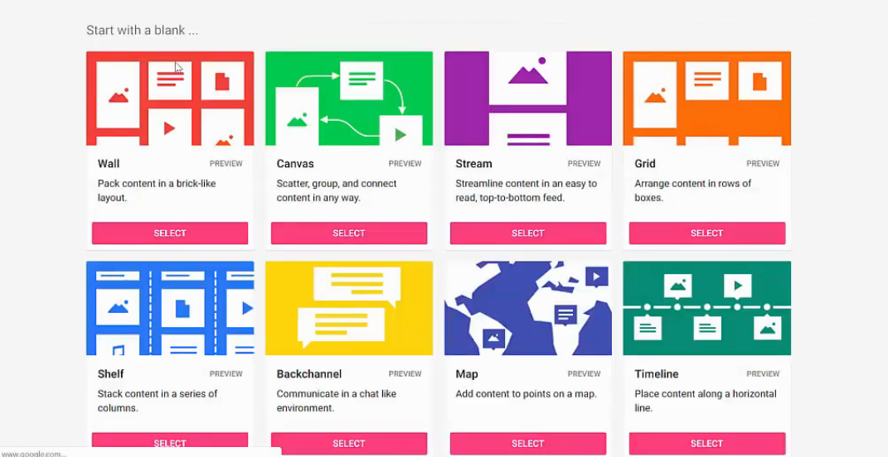
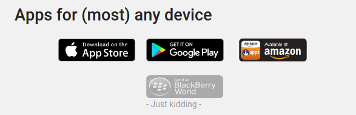

# Tools

## Tools zur Gruppenerstellung

* [Random Team Generator](https://www.randomlists.com/team-generator)
* [Random Group Generator](http://www.aschool.us/random/random-pair.php)

## Padlet
Mit Padlet (https://padlet.com) können Sie kollaborative Pinnwände erstellen, auf denen Texte, Bilder, Videos und Dateien übersichtlich strukturiert werden können.

Es gibt vielfältige Möglichkeiten, die Inhalte zu strukturieren, etwa als Mindmap, Zeitstrahl oder Todo-Liste.

Die Pinnwände können per privatem Link geteilt werden oder mit Passwort vor Zugriff geschützt werden. 
Andere Personen können berechtigt werden, die Pinnwand mitzugestalten oder aber nur Lesezugriff haben.

Sie können die Pinnwand auch auf anderen Webseiten einbetten, etwa auch Ilias (noch ungetestet).

Es sind Apps für Android und Apple erhältlich, mit denen man die Pinnwände auch mobil bearbeiten kann.
Padlet ist kostenfrei mit einer Begrenzung auch 25 MB pro hochgeladener Datei.

## Kollaboratives Schreiben

Praktische Tools zum kollaborativen Schreiben sind:

* [Dropbox Paper](https://paper.dropbox.com/?_tk=dropbox_web_logged_out_landing_page&role=personal)
* [Google Docs](https://www.google.de/intl/de/docs/about/)
* [Book Creator](https://bookcreator.com/)
* [GitBook](https://www.gitbook.com/)

