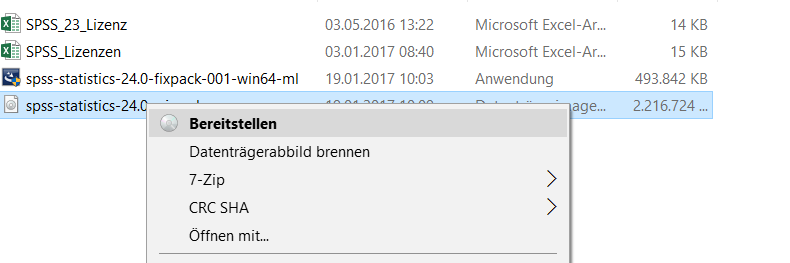

# SPSS

## SPSS installieren

### Mac

### Windows

Das Setup liegt in einer ISO-Datei verpackt. **Platzhalter:** Diese befindet sich unter Owncloud\0_Institut\3_EDV\spss-statistics-24.0-win-ml **Platzhalter**

Mit Rechtsklick -> "Bereitstellen" wird die ISO-Datei eingehängt und wird nun unter "Dieser PC" als DVD angezeigt. Öffnen Sie sie und starten Sie das Setup.

## Lizenzverlängerung

Die Ausgangssituation: SPSS zeigt an, dass das Datum für die Lizenzverlängerung verstrichen ist. Es muss ein neuer Lizenzschlüssel eingegeben werden.

 

Dafür muss der Lizenzauthorisierungsassistent gestartet werden. Unter Windows öffnen Sie das Startmenü und suchen nach "SPSS Lizenzauthorisierung".

Unter Mac drücken Sie [⌘+Leertaste] und suchen nach "SPSS Lizenzauthorisierung". Alternativ finden Sie den Lizenzautorisierungsassistenten auch im Ordner "Anwendungen" -> "SPSS Statistics".

 

Zunächst erscheint nochmals der Hinweis, die Lizenz sei abgelaufen. Klicken Sie auf Weiter.

Wählen Sie "Mein Produkt jetzt lizenzieren".

 

Die Lizenzschlüssel liegen in der OwnClowd unter: **\\ownCloud\0_Institut\4_EDV\SPSS-Lizenzen.xlsx**

**Für jede Person und SPSS-Version gibt es einen separaten Schlüssel.** Die aktuelle Version wird in der Kopfzeile des Assistenten abgezeigt. 

Kopieren Sie Ihren persönlichen Schlüssel in den Assistenten und klicken Sie auf Weiter.

Bei erfolgreicher Lizenzaktivierung sollte ein grüner Text erscheinen:

 

 
Klicken Sie Weiter und Fertigstellen. Die Lizenz ist nun 12 Monate gültig.