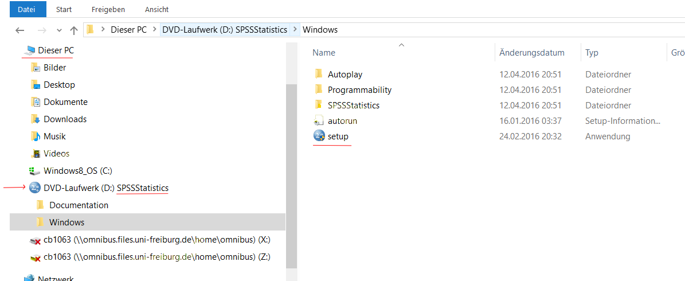

# SPSS

Hier finden Sie Anleitungen zum Installieren und Lizenzieren von SPSS.

1. [SPSS auf Mac installieren](#macos)

2. [SPSS unter Windows installieren](#windows)

3. [Lizenzieren bzw. Lizenzverlängerung](#lizenzverlängerung)

4. [Installation von PROCESS](#installation-von-process)

## SPSS installieren

### MacOS

Das Setup liegt in einer ISO-Datei verpackt. Diese befindet sich in Owncloud unter der Adresse: `0_Institut\3_EDV\spss-statistics-25.0-mac-ml`. 

Öffnen Sie das DiskImage mit Rechtsklick -> "Öffnen mit" -> "DiskImageMounter". 

Nun erscheint es auf der linken Seite des Finders unter "Geräte" als "SPSSStatistics". Öffnen Sie es und den darin verpackten Installer.

Bestätigen Sie, dass Sie das Programm öffnen möchten und starten Sie die Installation.

### Windows

Das Setup liegt in einer ISO-Datei verpackt. Diese befindet sich in Owncloud unter der Adresse: `0_Institut\3_EDV\spss-statistics-25.0-win-ml`. 

Mit Rechtsklick -> "Bereitstellen" wird die ISO-Datei eingehängt und wird nun unter "Dieser PC" als DVD angezeigt. Öffnen Sie darin den Ordner Windows und starten Sie das Setup.

## Lizenzierung

Starten Sie den Lizenzauthorisierungsassistenten. 

Unter Windows öffnen Sie das Startmenü und suchen nach "SPSS Lizenzauthorisierung". Unter Mac drücken Sie [⌘+Leertaste] und suchen nach "SPSS Lizenzauthorisierung". Alternativ finden Sie den Lizenzautorisierungsassistenten auch im Ordner "Anwendungen" -> "SPSS Statistics".

Zunächst erscheint nochmals der Hinweis, die Lizenz sei abgelaufen. Klicken Sie auf Weiter. Wählen Sie "Mein Produkt jetzt lizenzieren".

 

Die Lizenzschlüssel liegen in der OwnClowd unter: `ownCloud\0_Institut\4_EDV\SPSS-Lizenzen.xlsx`. Suchen und kopieren Sie dort den Lizenschlüssel der jeweiligen SPSS Version zu Ihrem Namen.

Kopieren Sie Ihren persönlichen Schlüssel in den Assistenten und klicken Sie auf Weiter.

Bei erfolgreicher Lizenzaktivierung sollte ein grüner Text erscheinen:

 

Klicken Sie Weiter und Fertigstellen. Die Lizenz ist aktiviert.

## Installation von PROCESS

Laden Sie PROCESS von der offiziellen Seite herunter: https://www.processmacro.org/download.html

**Achtung:** Aufgrund eines Fehlers in der aktuellen MacOS-Version müssen Sie die heruntergeladene Datei in einen neuen Ordner in Ihrem Home-Verzeichnis verschieben.
Sie können PROCESS unter Mac nicht installieren, wenn es in einem der folgenden Ordner liegt: Downloads, Dokumente, Desktop, iCloud oder auf einer externen Festplatte. 

Nachdem Sie das Makro heruntergeladen und ggf. verschoben haben, entpacken Sie das Archiv.

Öffnen Sie den Unterordner **PROCESS v3.3 for SPSS** (die Versionsnummer kann variieren). 
Dort befindet sich ein weiterer Unterordner **Custom dialog builder file**.

In diesem Ordner befindet sich die Datei process.sps, die das Makro enthält.
Öffnen Sie sie mit einem Doppelklick und klicken Sie auf **Installieren**

Wenn alles geklappt hat, bestätigt SPSS die Installation mit einem Dialog.

Das Makro ist nun installiert. Sie finden es unter **Analysieren > Regression > PROCESS v3.3**.

