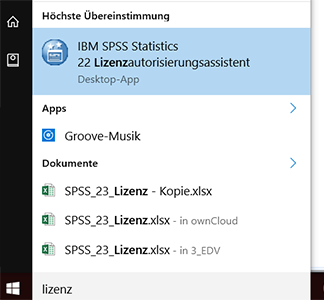
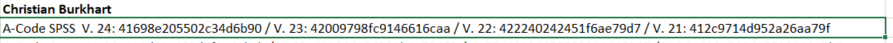

# SPSS

Hier finden Sie Anleitungen zum Installieren und Lizenzieren von SPSS.

1. [SPSS auf Mac installieren](#macos)

2. [SPSS unter Windows installieren](#windows)

3. [Lizenzieren bzw. Lizenzverlängerung](#lizenzverlängerung)

## SPSS installieren

### MacOS

Das Setup liegt in einer ISO-Datei verpackt. **Platzhalter:** Diese befindet sich unter Owncloud\0_Institut\3_EDV\spss-statistics-24.0-win-ml **Platzhalter**

Öffnen Sie das DiskImage mit Rechtsklick -> "Öffnen mit" -> "DiskImageMounter". 

Nun erscheint es auf der linken Seite des Finders unter "Geräte" als "SPSSStatistics". Öffnen Sie es und den darin verpackten Installer.

Bestätigen Sie, dass Sie das Programm öffnen möchten und starten Sie die Installation.

### Windows

Das Setup liegt in einer ISO-Datei verpackt. **Platzhalter:** Diese befindet sich unter Owncloud\0_Institut\3_EDV\spss-statistics-24.0-win-ml **Platzhalter**

Mit Rechtsklick -> "Bereitstellen" wird die ISO-Datei eingehängt und wird nun unter "Dieser PC" als DVD angezeigt. Öffnen Sie darin den Ordner Windows und starten Sie das Setup.

## Lizenzierung

Starten Sie den Lizenzauthorisierungsassistenten. 

Unter Windows öffnen Sie das Startmenü und suchen nach "SPSS Lizenzauthorisierung".

Unter Mac drücken Sie [⌘+Leertaste] und suchen nach "SPSS Lizenzauthorisierung". Alternativ finden Sie den Lizenzautorisierungsassistenten auch im Ordner "Anwendungen" -> "SPSS Statistics".

Zunächst erscheint nochmals der Hinweis, die Lizenz sei abgelaufen. Klicken Sie auf Weiter. 

Wählen Sie "Mein Produkt jetzt lizenzieren".

 

Die Lizenzschlüssel liegen in der OwnClowd unter: **\\ownCloud\0_Institut\4_EDV\SPSS-Lizenzen.xlsx**

**Für jede Person und SPSS-Version gibt es einen separaten Schlüssel.** Die aktuelle Version wird in der Kopfzeile des Assistenten abgezeigt. 

Kopieren Sie Ihren persönlichen Schlüssel in den Assistenten und klicken Sie auf Weiter.

Bei erfolgreicher Lizenzaktivierung sollte ein grüner Text erscheinen:

 

Klicken Sie Weiter und Fertigstellen. Die Lizenz ist nun 12 Monate gültig.