# Drucker

In dieser Dokumentation finden Sie folgende Informationen:

- [Wo befinden sich die Drucker?](#wo-befinden-sich-die-drucker)
- [Drucker einrichten (Windows)](#drucker-einrichten-windows)
- [Drucker einrichten (Mac)](#drucker-einrichten-mac)
- [Scans per E-Mail](#scans-per-e-mail-schicken)
- [E-Mail ins Adressbuch eintragen](#e-mail-ins-adressbuch-eintragen)

## Wo befinden sich die Drucker?

Es gibt einen Drucker im 3. OG und einen im 4. OG. Die Drucker stehen direkt bei der Eingangstür.
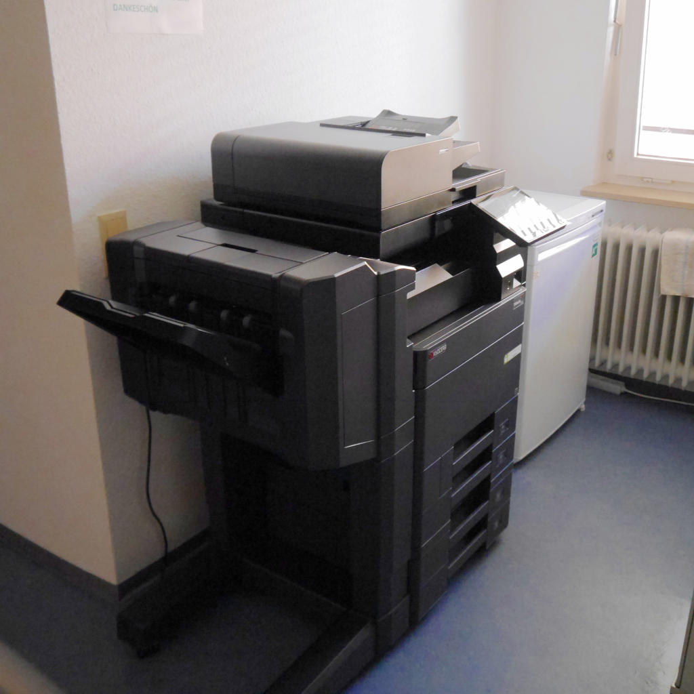

## Drucker einrichten (Windows)

Wählen Sie **Start** und tippen Sie "Drucker" ein. Wählen Sie **Geräte und Drucker** bzw. **Drucker & Scanner** aus.

Überprüfen Sie, ob dort der Name des Druckers aufgeführt ist. 

Die Modellnummer der Drucker im 3.OG lautet: TASKalfa 4053ci  
Die Modellnummer der Drucker im 4.OG lautet: TASKalfa 4012i

Eventuell müssen Sie zur Seite scrollen, um den Drucker zu finden.

Klicken Sie mit einem Rechtsklick auf den Drucker und wählen Sie **Als Standarddrucker festlegen**. Nun müsste der Drucker funktionieren.

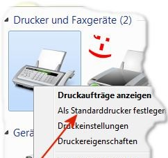

### Manuelle Druckerinstallation
Wählen Sie **Start** und tippen Sie "Drucker" ein. Wählen Sie **Geräte und Drucker** bzw. **Drucker & Scanner** aus.  
Falls der Drucker nicht angezeigt wird, können Sie ihn manuell hinzufügen.
Klicken Sie dazu auf "Drucker hinzufügen".

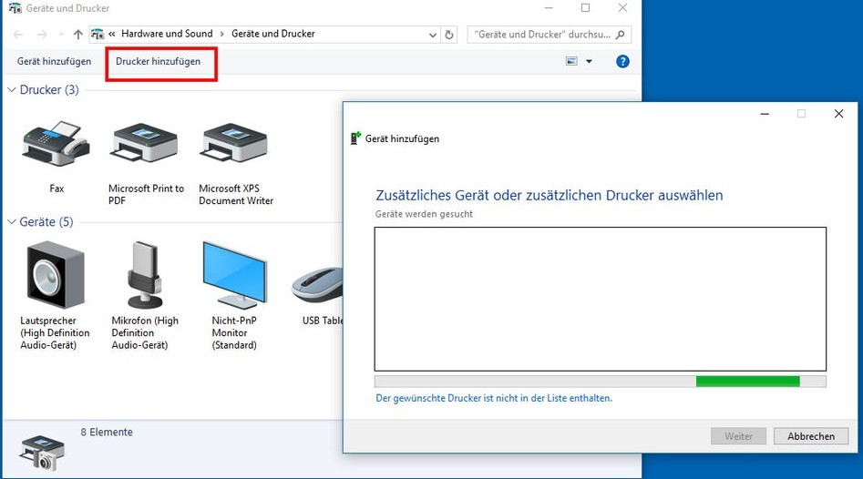

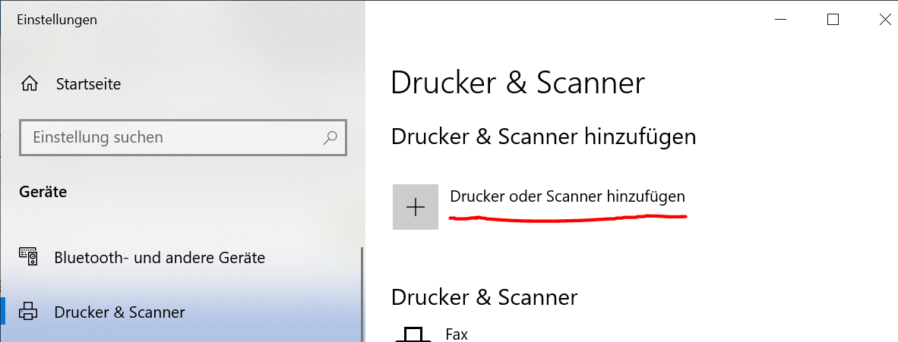

Klicken Sie nun auf "Der gesuchte Drucker ist nicht aufgelistet".

Wählen Sie nun die unterste Option "Lokalen Drucker oder Netzwerkdrucker mit manuellen Einstellungen hinzufügen" und klicken Sie auf Weiter.  
Wählen Sie die Option "Neuen Anschluss erstellen", und als Anschlusstyp: ```Standard TCP/IP Port```.

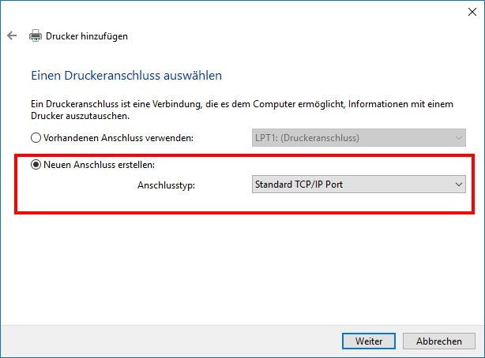

Nun können Sie die IP-Adresse inklusive Punkte eingeben:

```132.230.54.36``` (3.OG)
bzw.
```132.230.54.206``` (4.OG)

Als Anschlussname wählen Sie TASKalfa 3.OG bzw. TASKalfa 4.OG.

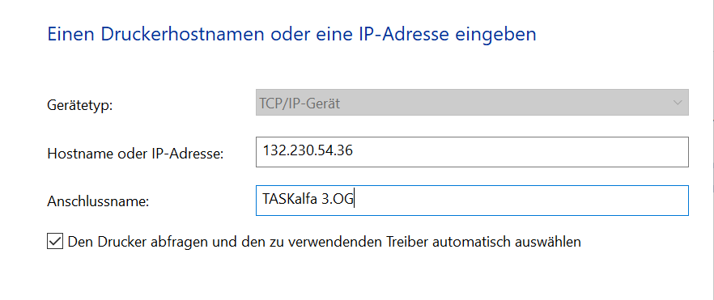

Setzen Sie das Häkchen bei "Den Drucker abfragen und den zu verwendenden Treiber automatisch auswählen".

Sofern "zusätzliche Anschlussinformationen erforderlich" sind, klicken Sie auf "Benutzerdefiniert" und auf "Einstellungen".  
Sollte das Fenster "Standard-TCP/IP-Portmonitor konfigurieren" angezeigt werden, wählt Sie bei Protokoll "LPR" aus und geben Sie bei Warteschlangenname die Modellnummer des Druckers ein. Setzen Sie zudem ein Häkchen bei LPR-Bytezählung.

Im nächsten Schritt müssen Sie **den Treiber installieren**.

Wählen Sie auf der linken Seite den Hersteller "Kyocera" und suchen in der rechten Liste die Modellnummer.

Die Modellnummer des Druckers im 3.OG lautet: Kyocera TASKalfa 4053ci XPS  
Die Modellnummer des Druckers im 4.OG lautet: Kyocera TASKalfa 4012i XPS

Diese Modellnummern befinden sich recht weit unten in der Liste.

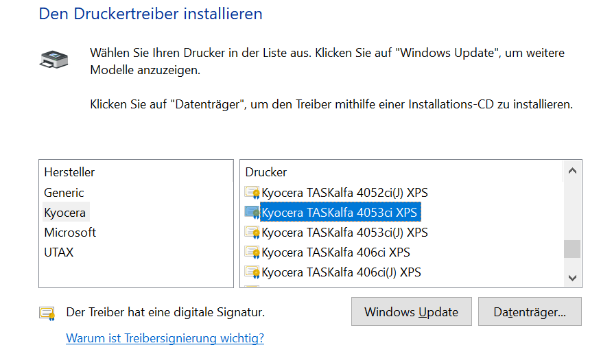

Falls das Modell nicht aufgelistet ist, klicken Sie auf den Knopf "Windows Update" und suchen erneut die Liste durch.

Wählen Sie im nächsten Schritt "nicht freigeben" und drucken Sie bei Bedarf eine Testseite, um zu sehen ob der Drucker richtig eingerichtet ist.

## Drucker einrichten (Mac)

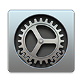

Öffnen Sie die Systemeinstellungen und wählen Sie "Drucker & Scanner". In der linken Spalte sind alle bereits installierten Drucker aufgelistet.

Überprüfen Sie, ob dort der Name des Druckers (3.OG bzw. 4.OG) aufgeführt ist.

Fügen Sie sonst über den "+"-Button unten links den Drucker hinzu. Es öffnet sich ein Fenster mit allen sichbaren Druckern. Wählen Sie hier den zu installierenden Drucker aus.

Die Modellnummer des Druckers im 3.OG lautet: ```Kyocera TASKalfa 4053ci XPS```  
Die Modellnummer des Druckers im 4.OG lautet: ```Kyocera TASKalfa 4012i XPS```

Die Netzwerkadresse (IP-Adresse) des Druckers im 3.OG lautet: ```132.230.54.36```  
Die Netzwerkadresse (IP-Adresse) des Druckers im 4.OG lautet: ```132.230.54.206```

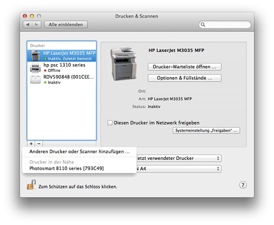

## Scans per E-Mail schicken

Drücken Sie die Home-Taste am Drucker, um ihn zu aktivieren.
Wählen Sie **Senden**.
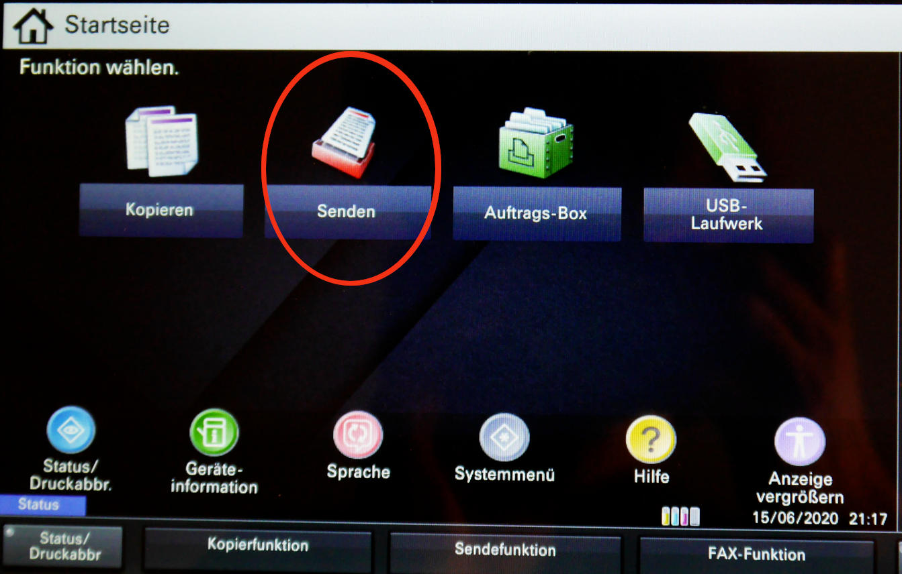
Wählen Sie Ihre E-Mail-Adresse aus den bestehenden aus oder fügen Sie sich dem Adressbuch hinzu (siehe unten).
Unten gibt es mehrere Reiter, "Ziel", "Basis" etc. Im Reiter "Basis" können sie die Scan-Auflösung und das Dateiformat inklusive Bildqualitä verändern sowie mehrere Scans in eine Datei zusammenfügen.
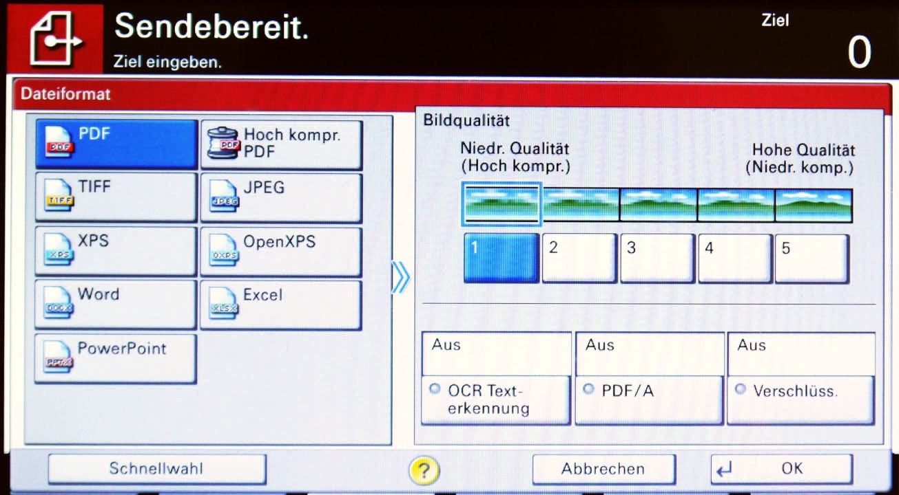

Sie können hier ebenfalls die OCR-Funktion aktivieren, um eine bearbeitbare Word- oder durchsuchbare PDF-Datei zu erstellen.
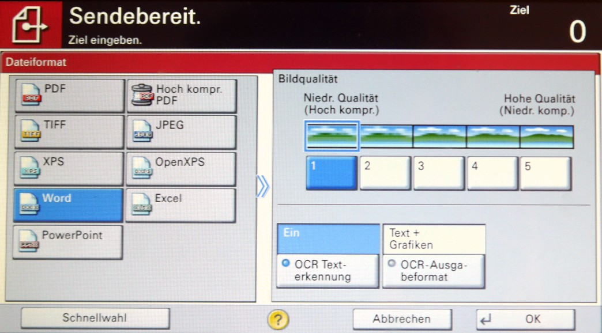

Sobald alle Einstellungen getroffen sind und Sie das Original eingelegt haben, drücken Sie die mechanische "Start"-Taste am Drucker.

## E-Mail ins Adressbuch eintragen

Um Ihre E-Mail nicht jedes Mal eingeben zu müssen, können sie sich ins Adressbuch eintragen.
Drücken Sie die Home-Taste am Drucker und wählen Sie **Senden**.


Klicken Sie nun rechts oben auf Adressbuch.

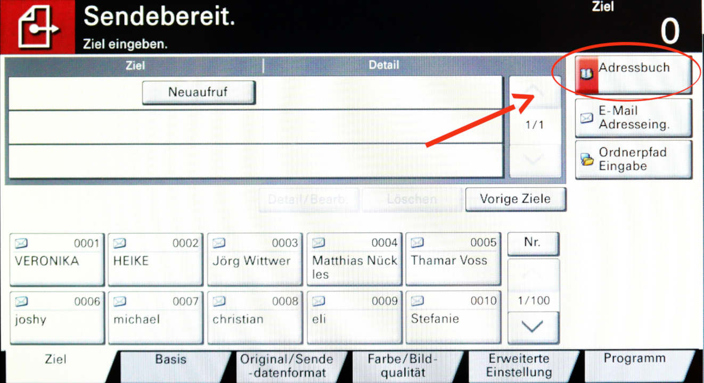

Klicken Sie auf der rechten Seite auf "Adressbuch speichern/bearbeiten".

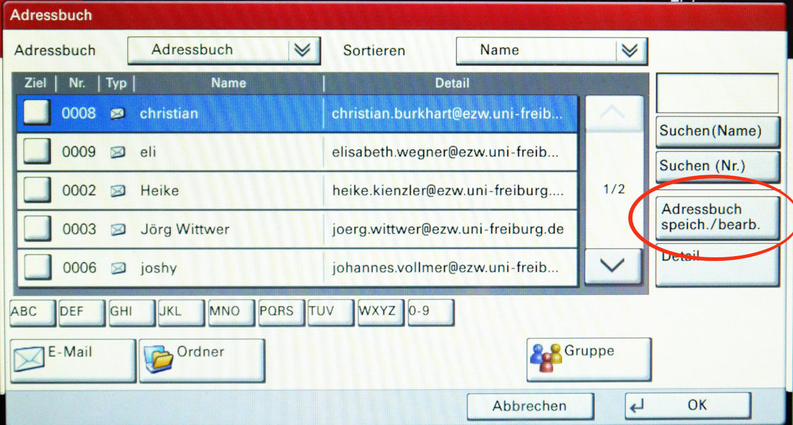

Wählen Sie "Adressbuch: Hinzufügen/bearbeiten".

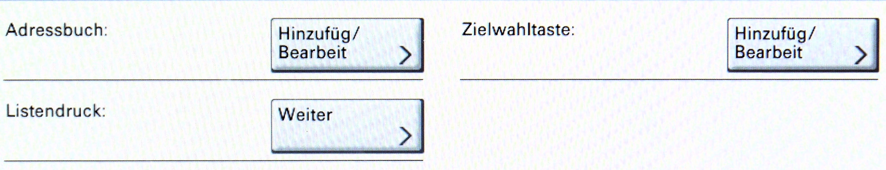

Wählen Sie auf der rechten Seite "Hinzufügen".

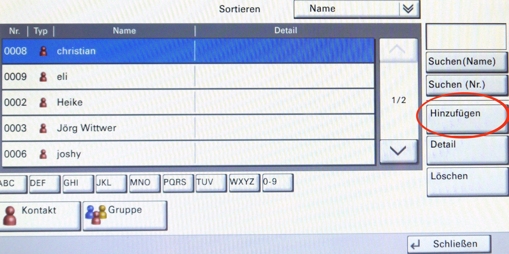

Wählen Sie "Kontakt". Geben Sie mit einem Klick auf "Ändern" neben dem Feld "Name:" Ihren Namen ein. Bestätigen Sie mit **OK**.

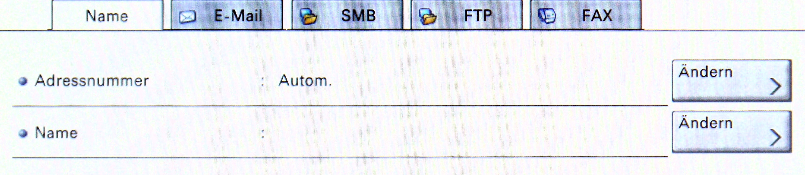

Wechseln Sie in den Reiter "E-Mail" und geben Sie mit einem Klick auf "Ändern" Ihre E-Mail-Adresse ein.
Bestätigen Sie mit **OK**.

Sie sollten nun den neu erstellten Kontakt auf der Seite "Sendebereit" sehen.
Wenn Sie ihn nicht sehen, können Sie mit den Pfeiltasten auf der rechten Seite herunterscrollen.


Überprüfen Sie die Einstellungen und starten Sie den Scan mit der mechanischen "Start"-Taste am Gerät.
Sie sollten nun eine E-Mail mit dem von Ihnen gescannten Dokument erhalten haben.