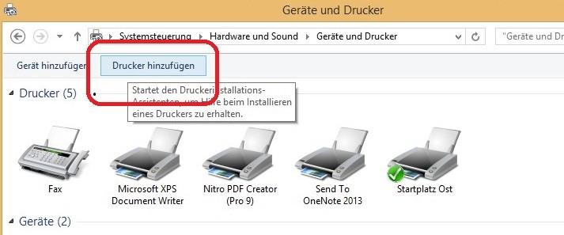

# Drucker

In dieser Dokumentation finden Sie folgende Informationen:

- [Wo befinden sich die Drucker?](#wo-befinden-sich-die-drucker)
- [Wie richtet man die Drucker ein (Windows)?](#wie-richtet-man-die-drucker-ein-windows)
- [Wie richtet man die Drucker ein (Mac)?](#wie-richtet-man-die-drucker-ein-mac)
- [Scans per E-Mail schicken](#scans-per-e-mail-schicken)
- [E-Mail ins Adressbuch eintragen](#e-mail-ins-adressbuch-eintragen)

## Wo befinden sich die Drucker?
Es gibt einen Drucker im 3. OG und einen im 4. OG. Die Drucker stehen direkt bei der Eingangstür.

## Wie richtet man die Drucker ein (Windows)?
Wählen Sie **Start** und tippen Sie "Drucker" ein. Wählen Sie **Geräte und Drucker** aus.

Überprüfen Sie, ob dort der Name des Druckers (3.OG bzw. 4.OG) aufgeführt ist. Eventuell müssen Sie zur Seite scrollen, um den Drucker zu finden.

Klicken Sie mit einem Rechtsklick auf den Drucker und wählen Sie **Als Standarddrucker festlegen**. Nun müsste der Drucker funktionieren.

Wird der Drucker nicht aufgeführt, klicken Sie auf **Drucker hinzufügen**.

Warten Sie, bis in der Nähe befindliche Drucker gefunden wurden, und wählen Sie dann **Gerät hinzufügen** aus.
Nun sollte sich der Drucker von alleine installieren. Typischerweise benötigen Sie keinerlei Treiber.

Wenn der Drucker nicht in der Liste aufscheint, wählen Sie **Der gesuchte Drucker ist nicht aufgeführt** aus, dann **Bluetooth- Drahtlos- oder Netzwerkdrucker** und folgen Sie dann den Anweisungen.
Wo finde ich die Treiber für die Drucker?

Sollten Sie den Drucker trotz dieser Anleitung nicht einrichten können, kontaktieren Sie Leonard Wölfl (contact(ät)leonard-woelfl.de).

## Wie richtet man die Drucker ein (Mac)?

Öffnen Sie die Systemeinstellungen und wählen Sie "Drucker & Scanner". In der linken Spalte sind alle bereits installierten Drucker aufgelistet.

Überprüfen Sie, ob dort der Name des Druckers (3.OG bzw. 4.OG) aufgeführt ist.

Fügen Sie sonst über den "+"-Button unter links den Drucker hinzu. Es öffnet sich ein Fenster mit allen sichbaren Druckern. Wählen Sie hier den zu installierenden Drucker aus.
Sie benötigen für die Installation keinerlei Treiber.

## Scans per E-Mail schicken
Drücken Sie die Home-Taste am Drucker, um ihn zu aktivieren.
Wählen Sie **Senden**.

Wählen Sie Ihre E-Mail-Adresse aus den bestehenden aus oder fügen Sie sich dem Adressbuch hinzu (siehe unten).
Unten gibt es mehrere Reiter, "Ziel", "Basis" etc. Im Reiter "Basis" können sie die Scan-Auflösung und das Dateiformat inklusive Bildqualitä verändern sowie mehrere Scans in eine Datei zusammenfügen.

Sie können hier ebenfalls die OCR-Funktion aktivieren, um eine bearbeitbare Word- oder durchsuchbare PDF-Datei zu erstellen.

Sobald alle Einstellungen getroffen sind und Sie das Original eingelegt haben, drücken Sie die mechanische "Start"-Taste am Drucker.

## E-Mail ins Adressbuch eintragen
Um Ihre E-Mail nicht jedes Mal eingeben zu müssen, können sie sich ins Adressbuch eintragen.
Drücken Sie die Home-Taste am Drucker und wählen Sie **Senden**.

Klicken Sie nun rechts oben auf Adressbuch.

Klicken Sie auf der rechten Seite auf "Adressbuch speichern/bearbeiten".

Wählen Sie "Adressbuch: Hinzufügen/bearbeiten".

Wählen Sie auf der rechten Seite "Hinzufügen".

Wählen Sie "Kontakt". Geben Sie mit einem Klick auf "Ändern" neben dem Feld "Name:" Ihren Namen ein. Bestätigen Sie mit **OK**.

Wechseln Sie in den Reiter "E-Mail" und geben Sie mit einem Klick auf "Ändern" Ihre E-Mail-Adresse ein.
Bestätigen Sie mit **OK**.

Sie sollten nun den neu erstellten Kontakt auf der Seite "Sendebereit" sehen.
Wenn Sie ihn nicht sehen, können Sie mit den Pfeiltasten auf der rechten Seite herunterscrollen.

Überprüfen Sie die Einstellungen und starten Sie den Scan mit der mechanischen "Start"-Taste am Gerät.
Sie sollten nun eine E-Mail mit dem von Ihnen gescannten Dokument erhalten haben.

Bei Fragen können Sie sich gerne an Leonard Wölfl wenden (contact(ät)leonard-woelfl.de).