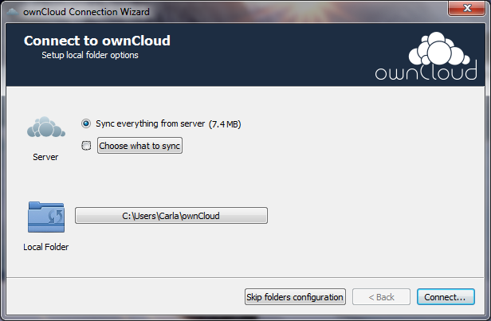
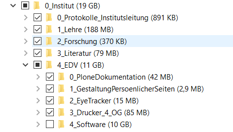

# ownCloud

Hier finden Sie folgende Inhalte:

- [ownCloud installieren und einrichten](#owncloud-installieren-und-einrichten)
- [Ordner synchronisieren und desynchronisieren](#ordner-synchronisieren-und-desynchronisieren)
- [Online auf ownCloud zugreifen](#online-auf-owncloud-zugreifen)
- [Ordner und Dateien teilen](#ordner-und-dateien-teilen)

## ownCloud installieren und einrichten
Laden Sie den ownCloud Desktop Client von der offiziellen Seite herunter:

- [ownCloud für MacOS](https://owncloud.org/download/#owncloud-desktop-client-macos)
- [ownCloud Windows](https://owncloud.org/download/#owncloud-desktop-client-windows)

Starten Sie die Installation mit einem Doppelklick auf die heruntergeladene Datei.

Sie werden nach der Adresse des Servers gefragt. 
Diese lautet: `https://server.ezw.uni-freiburg.de/owncloud/`

Geben Sie im nächsten Schritt Ihre Zugangsdaten ein. 
Sollten Sie einen Zugang benötigen, kontaktieren Sie Christian Hess, dieser erstellt und verwaltet die Zugänge: christian.hess|at|ezw.uni-freiburg.de

Wählen Sie, ob Sie alle Ordner synchronisieren möchten oder nur eine Auswahl.

Zudem können Sie das Verzeichnis, in dem ownCloud Ihre Dateien speichert und synchronisiert, anpassen. Meist genügt es jedoch, die Standardoptionen zu wählen.

Klicken Sie nun auf "Connect...", um die Einrichtung abzuschließen.

Wenn die Einrichtung erfolgreich war, bekommen Sie zwei Knöpfe zum Öffnen der lokalen ownCloud und des Web-Zugangs angezeigt. 
Ihre Dateien werden nun synchronisiert.

## Ordner synchronisieren und desynchronisieren

In ownCloud können Sie für jeden Ordner entscheiden, ob er synchronisiert wird oder nicht.
Jedoch kann es sinnvoll sein, manche Ordner zu desynchronisieren. Dies erreichen Sie mit einem Klick auf das Häkchen.

- Ein Haken zeigt an, das der lokale Ordner inklusive aller Unterordner mit ownCloud synchronisiert wird.
- Ein leere Kästchen zeigt an, dass der Ordner nicht synchronisiert wird.
- Ein schwarzes Quadrat zeigt an, dass manche Unterordner synchronisiert und andere nicht synchronisiert werden.
Klappen Sie die Ordnerstruktur aus, um feinere Einstellungen zu treffen.

## Online auf ownCloud zugreifen
Sie können auf die ownCloud-Dateien auch über den Browser zugreifen, ohne ownCloud zu installieren.
Rufen Sie folgende Adresse auf: https://server.ezw.uni-freiburg.de/owncloud/index.php/login

Geben Sie den selben Nutzernamen und das selbse Passwort wie üblich ein. Nun sollten Sie auf Ihre Dateien zugreifen können.

## Ordner und Dateien teilen 

### Freigabe vom Explorer / Finder aus

Sobald sie ownCloud auf Ihrem Computer installiert haben, ist ownCloud auch in Windows Explorer bzw. Finder auf Mac integriert.

Öffnen Sie den lokalen ownCloud Ordner auf Ihrem Computer. Synchonisierte Dateien werden mit einem grünen Haken markiert. 
Um einen Ordner freizugeben, muss er synchronisiert werden. Klicken Sie dann mit Rechtsklick bzw. `Ctrl`+`Klick` (MacOS) auf den Ordner und wählen **Share with ownCloud**.

Sie können nun:

- Dateien und Ordner mit andern ownCloud Nutzern des Instituts teilen
- Datein und Ordner öffentlich mittels eines Links teilen
- Bestehende Freigaben einsehen, ändern und löschen

Um eine Freigabe zurückzuziehen, entfernen das Häkchen bei "Share Link".

### Freigabe von der Weboberfläche

[Loggen Sie sich zunächst in der Weboberfläche ein.]((#online-auf-owncloud-zugreifen))

Nun sehen Sie alle synchronisierten Dateien.

Klicken Sie auf die Schaltfläche "Freigeben" .

Sie können nun:

- Dateien und Ordner mit andern ownCloud Nutzern des Instituts teilen
- Datein und Ordner öffentlich mittels eines Links teilen
- Bestehende Freigaben einsehen, ändern und löschen

