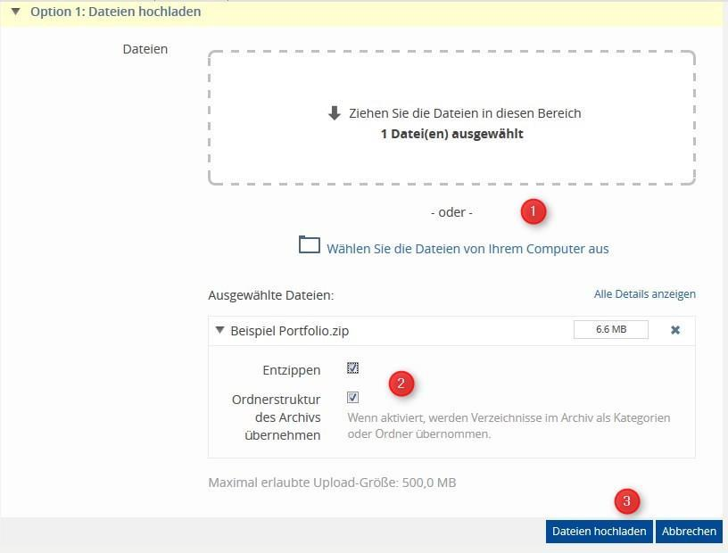

# Ordner und Dokumente

Um in Ihren Kurs Materialien hochzuladen, wechseln Sie auf den Reiter
„Inhalte“ und klicken rechts auf „Neues Objekt hinzufügen“.

## Dateien
Wählen Sie „Datei“ aus. Sie können nun entscheiden, ob Sie eine oder mehrere Dateien per Drag&Drop
auf ILIAS ziehen oder diese von Ihrem Computer auswählen.
Sie können den Dateinamen nachträglich über „Aktionen“ -> „Inhalt bearbeiten“ ändern.

Infos zum Videoupload in ILIAS finden sie hier: [Videos/Videos auf ILIAS](./docs-videos-upload-ilias)

## Ordner
Wählen Sie „Ordner“ aus und geben Sie diesem einen Titel. Dieser ist
nun in Ihrem Kurs sichtbar und kann mit Dateien gefüllt werden. 
Beim Typ **„Standardordner“** dürfen nur die Kurs-Admins und Tutoren, beim Typ **„Uploadordner“** auch die Kursmitglieder Dateien
hochladen.

Über den Reiter „Verwalten“ können Sie bereits hochgeladene Dateien in den Ordner verschieben.

## Mehrere Ordner hochladen
Sie haben die Möglichkeit,
alle Ordner bereits auf Ihrem
Arbeitsrechner vorzubereiten,
mit Dateien zu füllen und als
Ganzes auf ILIAS hochzuladen.
Dies erspart eine Menge Arbeit.

Führen Sie zunächst auf Ihrem lokalen
Datenträger die gewünschten
Ordner und Dateien **in einer zip-Datei** zusammen. Anschließend
ziehen Sie die zip-Datei per
Drag&Drop oder über „Wählen
Sie die Dateien von Ihrem
Computer aus“ auf ILIAS (1).
ILIAS erkennt automatisch, dass
es sich um eine zip handelt.

Haken Sie „Entzippen“ an (2),
lassen Sie „Ordnerstruktur des
Archivs übernehmen“ aktiviert und bestätigen Sie mit „Dateien hochladen“ (3).

