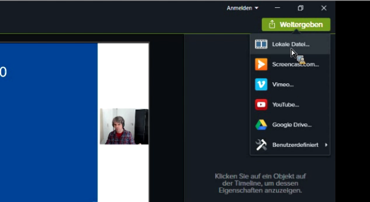
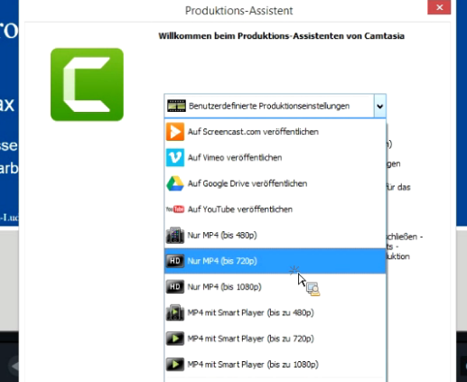

# Camtasia

## Aufzeichnung mit Camtasia

Vom Rechenzentrum gibt es ein umfassendes Video zur Aufzeichnung mit Camtasia.

Ab 20:50 gibt es Empfehlungen zu Umfang und der Vorbereitung von Onlinevorlesungen.

Ab 31:30 geht es konkret um die Programmoberfläche anhand einer Beispielvorlesung.

<iframe
  width="640"
  height="360"
  src="https://videoportal.vm.uni-freiburg.de/media/embed?key=503cf8f2f5e0fbe99c5a85939f808ba9&width=640&height=360&autoplay=false&autolightsoff=false&loop=false&chapters=false&related=false&responsive=false&t=1250
"
  allowfullscreen
></iframe>

## Praktische Tastenkombinationen

Unter Windows starten Sie die Aufzeichnung mit der Taste **F9** und stoppen Sie mit **F10**. Pausieren und Fortfahren geschieht ebenfalls durch **F9**.

Unter MacOS starten Sie die Aufzeichnung mit **Command+Shift+2** und stoppen mit **Command+Option+2**. Pausieren und Fortfahren geschieht ebenfalls mit **Command+Shift+2**.

## Exportieren für Ilias
Klicken Sie im grünen Menü "Weitergeben" auf "Lokale Datei" und wählen Sie "Nur MP4 (720p)". Diese Einstellung ist für die meisten Anwendungen ausreichend und sorgt dafür,
dass die Dateigröße "im Rahmen bleibt".
 

## Upload

Nun können Sie das [Video auf Ilias hochladen](./docs-videos-upload-ilias)!