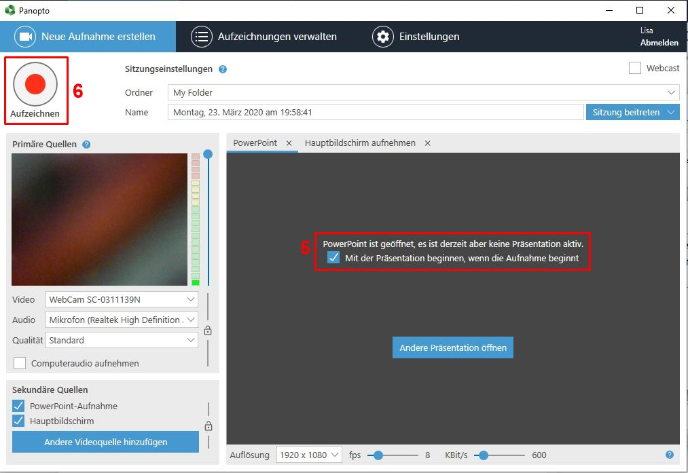
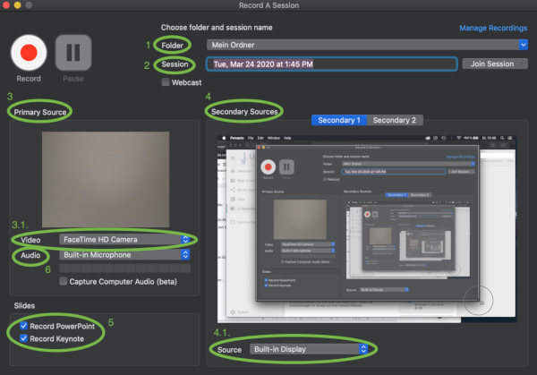
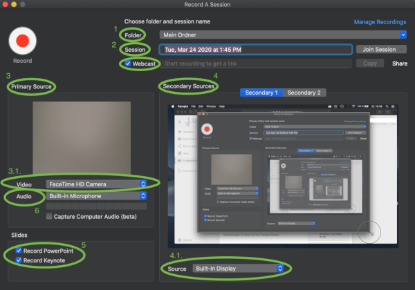
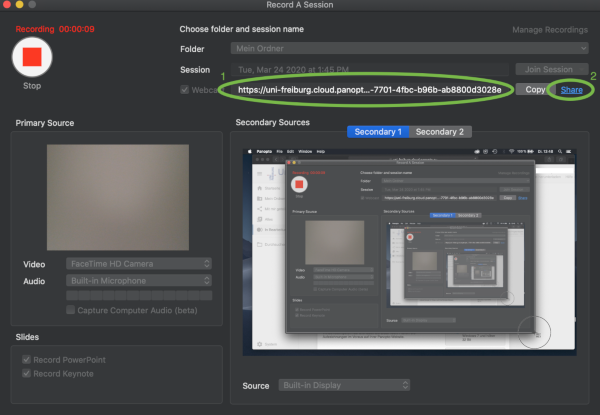

# Panopto

Panopto können Sie für Live-Webcasts und Webinare nutzen, zur Bildschirm- und Powerpointaufzeichnung verwenden
sowie Videobearbeitung mit vielfältige Anmerkungen und Quizzes durchführen.

Hier ein umfassendes Webinar zu Panopto und Illias.

<iframe src="https://www.videoportal.uni-freiburg.de/media/embed?key=8211679d99e8ebfdac9496c3c1969369&width=720&height=405&autoplay=false&autolightsoff=false&loop=false&chapters=false&related=false&responsive=false&t=0" data-src="" class="iframeLoaded" width="720" height="405" frameborder="0" allowfullscreen="allowfullscreen" allowtransparency="true" scrolling="no"></iframe>

## Panopto-Objekt erstellen

Wählen Sie in Ihrem Kurs "Neues Objekt"-> "Panopto".

**Geben Sie als Titel den exakten Namen Ihres Ilias-Kurses an, damit die Kursteilnehmer das Video/ den Webcast später sehen können.**

Klicken Sie dann auf "Erstellen". Vergessen Sie nicht, im Reiter "Einstellungen" das Panopto-Objekt online zu stellen.

## Videos hochladen

Nun können Sie im Reiter "Videos" über die Schaltfläche "Erstellen" -> "Medien hochladen".

Um das Video nun Ihren Kursmitgliedern in ILIAS zur Verfügung zu stellen, kopieren Sie die im Menü "Freigeben" angezeigte URL.
Die Einstellung "Bestimmte Personen" darf aus Datenschutzrechtlichen Gründen nicht verändert werden!

## Aufzeichnung erstellen mit Panopto (Windows)
Um eine Aufzeichnung zu starten, klicken Sie auf „Erstellen” 
und wählen Sie anschließend „Neue Sitzung aufzeichnen” aus. 

Dann öffnet sich der Panopto-Recorder, sofern Sie diesen bereits heruntergeladen haben.
Nun kann im oberen Feld der Zielordner und der Name der Aufzeichnung eingegeben werden.

Unter „Primäre Quellen” (1) kann auf der linken Hälfte die Video- und Audioquelle sowie die
Qualität eingestellt werden (1.1), bei Bedarf kann auch die Computeraudio aufgenommen
werden. Das linke, kleinere Aufnahmefenster ist für die Aufzeichnung des Dozierenden mit
der integrierten Kamera gedacht. Ist keine Aufnahme des Dozierenden gewünscht, einfach
bei „Video” als Quelle „Keine” auswählen, sodass das Kamerabild verschwindet. Bitte
kontrollieren Sie vor einer Aufzeichnung auch das Mikrofon, indem Sie unter „Audio” die
geeignete Quelle auswählen. Die Lautstärke können sie am blauen Balken neben der
Webcam regeln, sodass sich der Ton im grünen Bereich bewegt. Dazu müssen Sie
gegebenenfalls in den Soundeinstellungen ihres Laptops/Computers die Intensität anpassen.

Als „Sekundäre Quellen“ (2) können unten „PowerPoint-Aufnahme” und „Hauptbildschirm”
ausgewählt werden. Ist beides ausgewählt, teilt sich der rechte, größere Bildschirm in
„PowerPoint” und „Hauptbildschirm aufnehmen” (3) auf.
Unter „Hauptbildschirm aufnehmen” wird während der gesamten Aufzeichnung das Display aufgenommen, sodass
auch die Maus-Bewegungen verfolgt und Aktionen auf dem Bildschirm bei Bedarf erklärt
werden können. Eine Vorschau davon kann unten aktiviert werden, wenn das Häkchen bei
„Bildschirmaufnahmevorschau aktivieren” (3.1) gesetzt ist.

Im Feld „PowerPoint” (4) kann eine Präsentation geöffnet werden (4.1), entweder vor oder
nach Beginn der Aufzeichnung.

Wenn Sie die PowerPoint-Präsentation bereits vor der Aufzeichnung öffnen möchten, wird
folgendes Fenster aufgerufen. Hier können Sie entscheiden, ob beim Öffnen direkt die
Aufzeichnung gestartet werden soll oder erst später.

Wenn Sie auf „Nein” klicken, können Sie trotzdem direkt beim Start der Aufzeichnung die
PowerPoint öffnen lassen, sofern das Häkchen im nachfolgenden Fenster (5) aktiviert ist.
Wenn Sie nicht mit der PowerPoint starten möchten, deaktivieren Sie das Häkchen. Dann
können Sie die Aufzeichnung mit Klicken auf den roten Button (6) starten.

Nach dem Beenden öffnet sich ein Fenster, in dem Sie die Aufzeichnung umbenennen, den
Zielordner überprüfen und – wenn gewünscht – eine Beschreibung hinzufügen können.
Anschließend können Sie die Aufzeichnung fertigstellen (9), sodass diese in Ihren Ordner
hochgeladen wird, oder direkt löschen und bei Bedarf neu aufnehmen (10).

## Aufzeichnung erstellen mit Panopto (macOS)
Um eine Aufzeichnung zu starten, klicken Sie auf „Erstellen” 
und wählen Sie anschließend „Neue Sitzung aufzeichnen” aus. 

Dann öffnet sich der Panopto-Recorder, sofern Sie diesen bereits heruntergeladen haben.

Im Panopto-Recorder kann unter „Folder“ (1) ausgewählt werden, wo das Video später gespeichert werden soll, 
und unter „Session“ (2) können Sie die Aufzeichnung benennen.

Der Panopto-Recorder ist in „Primary Source” (3) und „Secondary Sources” (4) aufgeteilt.
Hier können jeweils verschiedene Quellen eingestellt werden, die später als Splitscreen
sichtbar sind (z.B. Integrierte Kamera und Display). Für eine Aufnahme mit dem Dozierenden
im linken kleinen Bild und einer Präsentation im größeren rechten Bild, wählen Sie unter
„Video“ (3.1.) die „Integrierte Kamera” aus und unter „Source“ (4.1.) den „Built-in Display”.
Es können hier auch andere Quellen angeschlossen werden, die dann unter 4.1. ausgewählt
werden. „Secondary 2“ auf der rechten Seite ist für eine weitere externe Quelle gedacht,
wenn diese benötigt wird.
Wollen Sie eine Präsentation zur Aufzeichnung miteinbinden, dann bitte links unten unter
„Slides“ (5) das für Ihre Präsentationssoftware passende Häkchen setzen („Record
PowerPoint” oder „Record Keynote”). Ihre Präsentation können Sie vor der Aufnahme schon
einmal öffnen, um Sie dann nach Betätigen des roten „Record“-Buttons oben links zu
starten.

Bitte kontrollieren Sie vor der Aufzeichnung auch das Mikrofon (6). Hier können Sie ebenfalls
verschiedene Quellen auswählen, sofern diese angeschlossen/installiert sind. Für das oben
beschriebene Szenario hier bitte „Built-in Microphone” auswählen. Der Balken darunter
sollte sich im grünen Bereich bewegen, um eine gute Tonqualität zu erreichen. Dazu müssen
Sie gegebenenfalls in den Soundeinstellungen ihres Laptops/Computers die Intensität
anpassen.

Die Qualität der Kamera können sie oben links unter „Panopto” und dann „Preferences”
bearbeiten. Für Präsentationen empfiehlt es sich, die Auswahl „High (motion)” zu wählen.

 

Nachdem alle Quellen ausgesucht sind, starten Sie die Aufnahme, rufen Ihre Präsentation
auf und starten auch diese. Nun können Sie wie gewohnt ihren Vortrag halten. Natürlich
können Sie während ihrer Aufzeichnung auch jederzeit auf „Pause“ drücken. Zum Beenden
der Aufzeichnung drücken Sie auf „Stop”.

Nun können Sie die Aufzeichnung benennen, eine Beschreibung eingeben und mit „Upload“ hochladen. 
Sie können die Aufnahme auch erneut starten, sodass die aufgenommene Datei automatisch gelöscht wird. 
Dazu einfach auf „Delete and record again” klicken.

## Livestream/Webcast erstellen (Windows)

Zum Starten eines Livestreams wählen Sie das Fenster „Erstellen” an und klicken
anschließend auf die Funktion „Neue Sitzung aufzeichnen”, wie zur Erstellung einer
normalen Sitzungsaufzeichnung. Anschließend öffnet sich der Panopto-Recorder.

Die Benennung der Aufzeichnung und die Einstellung von Kamera und Mikrofon im Panopto-
Recorder verlaufen gleich, wie zur Erstellung einer normalen Sitzungs-Aufzeichnung.

Um daraus einen Livestream zu machen, klicken Sie auf das Feld „Webcast” (1) rechts oben. Ist das Feld mit
einem Häkchen aktiviert, kann der Livestream gestartet werden.
Im Bereich unten rechts wird nun die Diskussions-Leiste (2) eingeblendet, hier werden
Diskussionsbeiträge von ZuschauerInnen angezeigt. Um diese und weitere Funktionen zu
ändern, klicken Sie rechts oben im Menü des Panopto-Recorders auf „Einstellungen” (3).

Unter „Einstellungen” (3) können Sie Diskussionsbeiträge aktivieren (4).
Allerdings sehen Sie die Kommentare nur, wenn Sie gerade keine PowerPoint-
Präsentation geöffnet haben. 
Falls Sie das Video nach der Aufzeichnung automatisch in Ihren Ordner hochladen, 
sodass es auch nach dem Livestream zur Verfügung steht (Feld unter 5 ankreuzen: „Upload, wenn Panopto geschlossen wird”),
können die Beiträge im Diskussionsfeld auch im Nachhinein angesehen werden. Wenn Sie während des
Livestreams gar keine Kommentare zulassen wollen, deaktivieren Sie diese Funktion (4).

Um den Livestream zu starten, klicken Sie wie zur normalen Sitzungs-Aufnahme auf
„Aufzeichnen”. Sobald der Stream beginnt, wird rechts unten der Webcast-Link
angezeigt, den Sie nun für ZuschauerInnen kopieren oder freigeben können.

Die Studierenden, die sich in Ihrem Ilias-Kurs eingeloggt haben, finden
den Livestream aber auch auf normalem Weg über den Panopto-Ordner auf Ilias.

## Livestream/Webcast erstellen (macOS)

Wenn sich der Panopto-Recorder geöffnet hat, haben Sie dort die Möglichkeit, den Ordner
auszuwählen, in dem der beendete Stream gespeichert werden soll (1) sowie die Datei zu
benennen (2). Die Aufteilung der Quellen in „Primary Source“ (3/3.1.) und „Secondary
Sources“ (4/4.1/5) ist dieselbe wie zur Aufnahme einer ‚normalen‘ Aufzeichnung (siehe: 2.
Aufzeichnung erstellen mit dem Panopto-Recorder – 2.2 Mit macOS). Um nun einen
Livestream zu erstellen, setzen Sie das Häkchen bei „Webcast“ (unter der Ordnerauswahl (1)
und der Benennung der Session (2)).

Sobald Sie auf „Record“ klicken und damit den Livestream starten, wird ein Link generiert
(1), den Sie über „Share“ (2) mit Studierenden oder anderen ZuschauerInnen teilen können.
Die Studierenden, die sich in Ihrem Ilias-Kurs eingeloggt haben, finden den Livestream aber
auch auf normalem Weg über den Panopto-Ordner auf Ilias. Dann können Sie wie gewohnt
die Präsentation starten (falls benötigt) und Ihren Vortrag beginnen.

