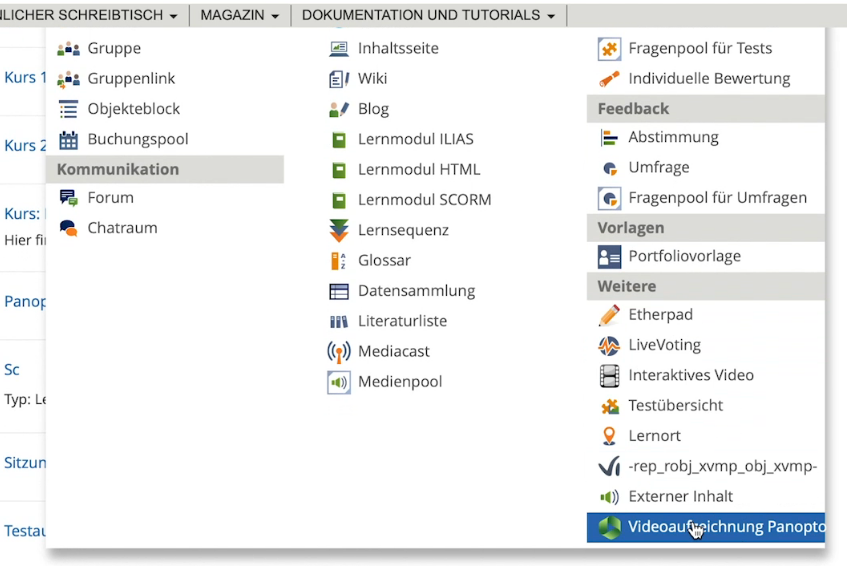
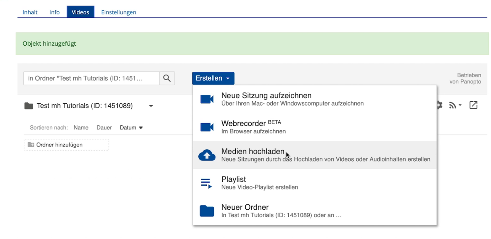
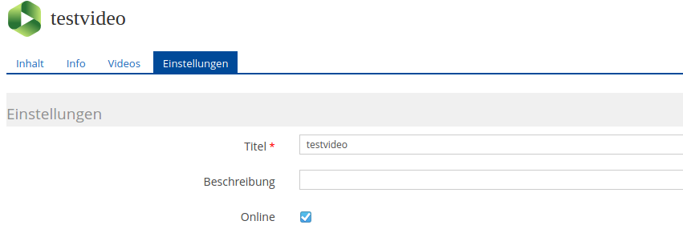
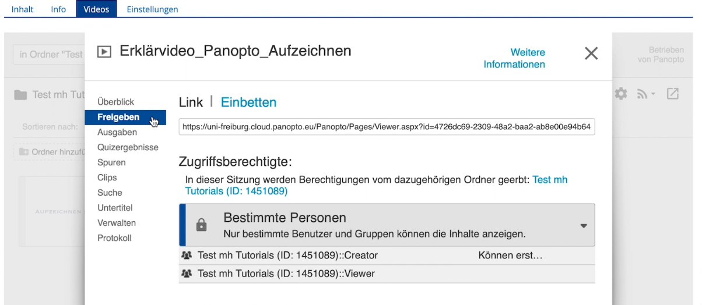
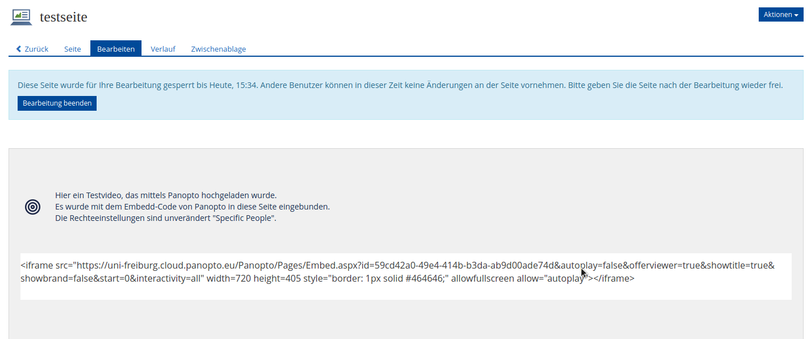

# Videos auf ILIAS hochladen

Um ein Video auf ILIAS hochzuladen, erstellen Sie einen neuen Panopto-Ordner in Ihrem Kurs: "Neues Objekt"-> "Videoaufzeichnung Panopto".
Geben Sie einen Titel ein und klicken Sie auf "Erstellen".

Dieser Ordner kann mehrere Videos enthalten, die im Reiter "Videos" über die Schaltfläche "Erstellen" -> "Medien hochladen" hochgeladen werden.

Wichtig: Stellen Sie das Video anschließend im Reiter "Einstellungen" online.

## Hochgeladene Videos einbinden
Um das Video nun Ihren Kursmitgliedern in ILIAS zur Verfügung zu stellen, 
kopieren Sie den für das ausgewählte Video angezeigte Embedd-Code und fügen Sie ihn auf der gewünschten Seite ein.

Informationen zur Aufzeichnung und Bearbeitung mit Panopto finden Sie hier: https://uni-freiburg.cloud.panopto.eu/Panopto/Pages/Sessions/List.aspx#