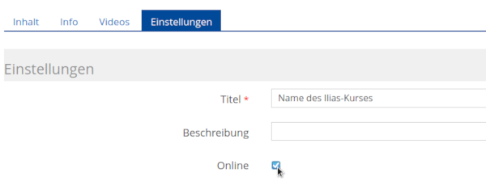

# Videos auf ILIAS

Um Videos so auf ILIAS einzubinden, dass sie direkt abspielbar sind, haben Sie folgende Möglichkeiten:

1. [Direkter Upload in Ilias](#direkter-upload-in-ilias)

2. [Einbetten über "Mediacast"](#einbetten-%C3%BCber-das-objekt-mediacast)

3. [Einbinden mittels Panopto](#einbinden-mittels-panopto)

4. [Einbinden über "ViMP"](#einbinden-%C3%BCber-vimp)

5. [Als Interaktives Video einfügen](#interaktives-video)

6. [Zu große Videos konvertieren](#zu-gro%C3%9Fe-videos-konvertieren)

## Direkter Upload in Ilias
Auf Kurs- und Ordner-Ebene gibt es oben auf der Seite einen Link "Seite gestalten". Klickt man auf
diesen Link, kann man anschließend über das [+]-Zeichen "Bild/Audio/Video einfügen" auswählen.
Über [Datei wählen] lässt sich im nächsten Schritt z.B. eine MP4-Videodatei auswählen.

 

Das Einbinden auf diesem Weg funktioniert auch in anderen ILIAS-Objekten (z.B. in Wikis, Lernmodulen
usw.). 

Die Uploadgrenze liegt bei 500 MB pro Video.

## Einbetten über das Objekt "Mediacast"
Das Objekt Mediacast findet man unter [Neues Objekt hinzufügen]. Der Mediacast eignet sich gut für
eine Video-Reihe, also – ähnlich, wie bei einem Podcast – für ein Video-Repositorium, das regelmäßig
um neue Videos ergänzt wird. Anders als bei der ersten Möglichkeit werden die Videos nicht in die
Kursseite eingebunden, sondern erscheinen in einem eigenen Objekt. Es lassen sich unterschiedliche
Darstellungsformen auswählen, optional kann auch ein Download ermöglicht werden. 

Die Uploadgrenze liegt auch hier bei 500 MB pro Video.

Hier finden Sie genaue Infos zum Videoupload mit Mediacast: https://ilias.uni-freiburg.de/goto.php?target=pg_57504_221303&client_id=unifreiburg

## Einbinden mittels Panopto

Wählen Sie in Ihrem Kurs "Neues Objekt"-> "Panopto".

**Geben Sie als Titel den exakten Namen Ihres Ilias-Kurses an, damit die Kursteilnehmer das Video später sehen können.**

Klicken Sie dann auf "Erstellen". Vergessen Sie nicht, im Reiter "Einstellungen" das Panopto-Objekt online zu stellen.

Nun können Sie im Reiter "Videos" über die Schaltfläche "Erstellen" -> "Medien hochladen".

Um das Video nun Ihren Kursmitgliedern in ILIAS zur Verfügung zu stellen, kopieren Sie die im Menü "Freigeben" angezeigte URL.
Die Einstellung "Bestimmte Personen" darf aus Datenschutzrechtlichen Gründen nicht verändert werden!

Eine knappe Videoanleitung finden Sie hier: [uni-freiburg.cloud.panopto.eu/Panopto/Pages/Viewer.aspx?id=...](https://uni-freiburg.cloud.panopto.eu/Panopto/Pages/Viewer.aspx?id=4ce65748-1aea-4723-b514-ab9000f5baa9)

Panopto können Sie ebenfalls für Webinare und zur Bildschirmaufzeichnungen nutzen, sowie vielfältige Anmerkungen und Quizzes einbetten:
[Infos zu den weiteren Möglichkeiten von Panopto](./docs-videos-panopto)

## Einbinden über "ViMP"
Bei ViMP handelt es sich um den Videoserver der Universität Freiburg 
(https://videoportal.uni-freiburg.de). 

Über [Neues Objekt hinzufügen] lassen sich Videos in Form eines eigenen Objekts
einbinden. Sobald man eine Videodatei hochgeladen hat, wird diese automatisch und im Hintergrund ins korrekte Format
konvertiert. Die Uploadgrenze liegt bei 10 GB, d.h., diese Methode eignet sich gut für
größere Videodateien. Die Videos lassen sich über das Plugin verwalten und können z.B. auch in
unterschiedliche Kurse eingebunden werden, ohne dass man sie mehrfach hochladen muss. Es
besteht außerdem ein erweiterter Content-Schutz und die Möglichkeit, ein ViMP-Video über "Seite
gestalten" einzubinden.

Hier finden Sie eine bebilderte Anleitung zum Einbinden über ViMP: [https://ilias.uni-freiburg.de/goto.php?target=wiki_1229029_ViMP-Objekt](https://ilias.uni-freiburg.de/ilias.php?ref_id=1229029&page=ViMP-Objekt&wpg_id=18079&cmd=downloadFile&cmdClass=ilwikipagegui&cmdNode=189:sm:18c&baseClass=ilwikihandlergui&file_id=il__file_1870362)

## Interaktives Video
Mit Hilfe dieses Werkzeuges können Sie im Video an beliebigen Stellen Fragen platzieren, die beim
Abspielen des Videos angezeigt werden, während das Video pausiert. Zudem können die Lernenden
und die Lehrenden einzelne Zeitpunkte oder ganz Passagen im Video annotieren bzw. kommentieren
und, falls gewünscht, die Kommentare der anderen Lernenden sehen. Alles, was dazu benötigt wird,
ist eine Video- oder Audio-Datei, die einfach auf ILIAS hochgeladen werden muss und von den
gängigen Browsern wiedergegeben werden kann (z.B. MP4/h.264). 

Über [Neues Objekt hinzufügen] können Sie das Objekt "Interaktives Video" erzeugen. Die Uploadgrenze liegt bei 500 MB. Sie können
aber auch Videos von youtube oder vimeo einbinden oder eine direkte URL zu einer Mediendatei im
Web angeben.

Hier finden Sie weitere Infos zu Interaktiven Videos:
https://ilias.uni-freiburg.de/goto.php?target=pg_37783_221303&client_id=unifreiburg

## Zu große Videos konvertieren
Sollte Ihr Video größer als das Uploadlimit sein, können Sie es mit einem Videokonverter in ein kompaktes Format umwandeln. Eine gute kostenfreie Software ist [Handbrake](https://handbrake.fr/).

**Kurzanleitung Handbrake**

Wählen Sie **Quelle** in der Werkzeugleiste oder ziehen Sie das Video per Drag & Drop in das Fenster.

**Videoeinstellungen wählen**

Geben Sie im Reiter **Bild** für Speichergeometrie (Auflösung) 1280x720 ein. 
Im Reiter **Video** stellen Sie die Bildrate auf "Wie Quelle" und geben eine **Bitrate** ein.
Für Bildschirmaufzeichnungen sind Werte von 1000 bis 2000 ausreichend, für bewegte Videos sind 5000 empfehlenswert.

**Den Ausgabeordner wählen**

Geben Sie einen Ausgabeordner und Dateinamen an. Dort wird das fertige Video gespeichert. Die Dateiendung sollte auf .mp4 oder .m4v gestellt sein.

Wählen Sie den Start-Knopf in der Werkzeugleiste, um den Kodiervorgang zu starten.